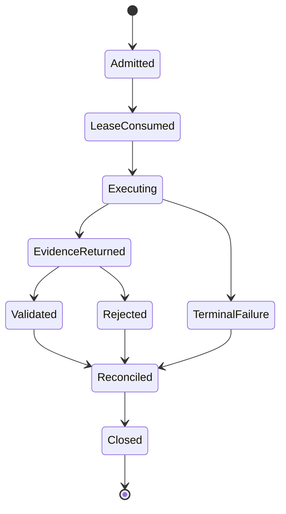

# Static Domain Model: Agentic Executor Control Plane

## Bounded Context

The **Agentic Executor Control Plane** translates a trusted, authorized BookSaver price-check intent
into one bounded browser-execution request and translates untrusted browser evidence into either a
validated observation set or a fail-closed rejection. It is upstream of the existing offer
equivalence/savings policy and downstream of authorization, session ownership, and check admission.

The context deliberately does not model a browser page, selector, provider tool, model prompt, or
Booking transaction. Those are adapter concerns or forbidden capabilities.

## Entities

### PriceExecution

One admitted browser observation job.

- **Identity**: `execution_id`, unique within the deployment.
- **Properties**: owner ID, booking ID, trusted query, session lease ID, limits, route, started time,
  terminal status, reconciled usage/cost, latency, and fallback-used flag.
- **Invariants**:
  - One execution belongs to exactly one authorized owner and booking.
  - The route is resolved before the session lease is consumed.
  - Terminal state is single-assignment.
  - Actual actions/time/cost cannot exceed admitted limits.
  - Execution content is never part of persisted identity or metrics.

### SessionLease

Single-use authority for local infrastructure to place one verified owner's encrypted session into
one fresh transient browser.

- **Identity**: opaque lease ID; cookie bytes are not an attribute of the domain entity.
- **Properties**: owner ID, booking ID, execution ID, issuance/expiry, state, refresh eligibility.
- **States**: `issued -> consumed -> closed`, with `expired` and `revoked` terminal alternatives.
- **Invariants**:
  - Owner, booking, and execution bindings are immutable.
  - Only local session infrastructure may resolve lease material.
  - Consumption is at most once and before expiry.
  - Closing the lease is required on every execution outcome.
  - Refresh eligibility requires code-owned authenticated-context verification on the same browser.

### QualificationState

Deployment-local authority consulted by routing; it carries only the current closed qualification
status and relevant timestamps, not raw canary evidence.

- **Identity**: singleton deployment policy version.
- **Properties**: status, policy version, qualified time, rollback-window end, regression flag.
- **Invariants**:
  - `qualified` is not inferred from an executor result.
  - A critical regression immediately makes agentic invitee routing inadmissible.
  - Legacy remains the default when the state is missing, unknown, or stale.

## Value Objects

### TrustedPriceQuery

- **Properties**: trusted property reference/name, check-in, check-out, adult/child/room occupancy,
  expected currency.
- **Constraints**: non-empty property identity, check-in before check-out, valid positive occupancy,
  uppercase supported currency, immutable after admission.

### ExecutionLimits

- **Properties**: absolute deadline, maximum total actions, maximum computer-use actions, maximum
  job cost in micro-USD, deployment-day remaining cost in micro-USD.
- **Constraints**: no more than 180 seconds, 15 total actions, 6 computer-use actions, USD 1.00 per
  job, or USD 10.00 per deployment UTC day; tighter caller limits are permitted.

### ObservedQueryFacts

- **Properties**: observed property reference/name, dates, occupancy, currency, authenticated flag,
  Genius flag, evidence completeness.
- **Constraints**: facts are evidence, not authority; unknown and conflicting values remain explicit.

### ObservedOffer

- **Properties**: visible room label, explicit all-in total, currency, refundability status,
  refundability text, all-in evidence status, evidence completeness, redacted provenance ID.
- **Constraints**:
  - Total is positive and currency is explicit.
  - Refundability is a three-state observation (`explicit_refundable`, `explicit_nonrefundable`,
    `unknown`), never guessed from absence.
  - No equivalence, confidence-of-equivalence, savings, or booking-action field exists.

### PriceExecutionResult

- **Properties**: closed terminal status, query facts, observed offers, redacted provenance, session
  refresh eligibility, model usage, reconciled cost, latency, fallback-used flag.
- **Constraints**:
  - Offers are present only with an observation-bearing terminal status.
  - No cookie/session value, screenshot, page text/tree, prompt, response, provider object, or model
    reasoning can be represented.
  - Terminal status comes from a closed enum including success, no valid observation, signed out,
    MFA, captcha, bot wall, unavailable, unsafe action, provider failure, budget, and timeout.

### ValidatedPriceObservation

- **Properties**: trusted query, independently matched observed facts, and offers that satisfy
  currency/all-in/refundability evidence gates.
- **Constraints**: creation is possible only through `PriceObservationValidator`; it still does not
  declare room equivalence or savings.

### ExecutionUsage

- **Properties**: semantic calls/actions, computer-use calls/actions, input/output tokens,
  micro-USD reserved, micro-USD actual, duration.
- **Constraints**: non-negative; actual cannot exceed reserved; computer-use actions are included in
  total actions; cost is reconciled on every terminal path.

### ExecutionRoute

Closed values: `legacy`, `owner_canary`, and `agentic`.

- Missing/unknown config resolves to `legacy` only if absent; invalid explicit values are rejected.
- `owner_canary` admits only the deployment owner.
- `agentic` for an invitee requires qualified state and current disclosure consent.

## Aggregates

### PriceExecution Aggregate

- **Root**: `PriceExecution`.
- **Members**: trusted query, execution limits, route, opaque session lease reference, terminal result,
  usage reconciliation.
- **Boundary**: one authorized price check.
- **Invariants**:
  - Admission, route, lease binding, and budget reservation precede executor invocation.
  - Result validation precedes offer evaluation or any persistence/notification effect.
  - Lease close and budget reconciliation happen exactly once even after exceptions.

### RoutingPolicy Aggregate

- **Root**: deployment routing configuration.
- **Members**: configured route, owner identity, qualification state, disclosure policy version, user
  acknowledgement.
- **Invariants**:
  - No role/qualification/consent ambiguity can broaden access.
  - Critical regression overrides configured `agentic` to legacy during the rollback window.

## Domain Services

### PriceObservationValidator

Compares untrusted executor evidence with the trusted query.

1. Require an observation-bearing terminal status.
2. Require complete, non-conflicting property/date/occupancy/authentication/currency facts.
3. Match facts against the trusted query using code-owned rules.
4. Retain only offers with explicit matching currency, all-in totals, and explicit refundability.
5. Return a validated observation or a typed rejection; never infer missing evidence.

### ExecutionRoutingPolicy

Resolves the effective route from configured mode, user role, current disclosure consent,
qualification state, and regression state. It cannot promote a deployment; it only admits or
degrades a requested route.

### ExecutionBudgetService

Reserves maximum exposure before execution, counts semantic and visual actions against one total,
records provider usage, calculates provider cost under the approved model policy, and reconciles
unused reservation on every outcome.

### SessionLeaseService

Issues/consumes/closes opaque owner-bound leases and accepts a refreshed-session candidate only after
same-browser code verification. The executor sees a lease interface/capability, never session bytes.

### ValidatedOfferAdapter

Transforms each validated observed offer into inputs for the existing BookSaver room-equivalence and
offer-selection policy. The adapter cannot mark a room equivalent; it supplies the visible label and
qualified price/refundability evidence to that policy.

## Repository Interfaces

### QualificationStateRepository

- `get_current() -> QualificationState`
- `record_regression(code, occurred_at) -> None`

The repository persists only closed status/timestamps and never raw page or model evidence.

### ExecutionMetricRepository

- `add(redacted_execution_metric) -> None`
- `list_for_qualification(window) -> metrics`

Stored fields are limited to route, closed outcome/rejection, eligibility, cost, latency, action
counts, fallback usage, model ID/profile, and timestamps.

No session repository is added to this context; existing encrypted per-user session storage remains
authoritative behind `SessionLeaseService`.

## Domain Events

- **PriceExecutionAdmitted**: execution/owner/booking IDs, route, limits, timestamp; no page/session
  content.
- **PriceObservationValidated**: execution ID, accepted offer count, closed provenance classes.
- **PriceObservationRejected**: execution ID, closed validation code.
- **ExecutionBudgetReconciled**: execution ID, reserved/actual micro-USD and action counts.
- **AgenticRegressionDetected**: policy version, closed critical violation code, timestamp.

Events are conceptual application signals; this bolt does not add a distributed event bus.

## State Transitions

Every path from `LeaseConsumed` reaches `Closed`; validation rejection is an expected fail-closed
domain outcome, not an exception that skips cleanup.

## Ubiquitous Language

- **Executor**: Replaceable adapter that perceives/navigates and returns untrusted typed evidence.
- **Control plane**: BookSaver code that owns admission, sessions, limits, validation, evaluation,
  persistence, and notifications.
- **Observation**: A provider-derived fact that must be independently validated.
- **Evidence completeness**: Explicit indication that all mandatory visible facts for a claim were
  observed; it does not mean the claim is trusted.
- **Session lease**: Opaque, single-use local capability for one owner/job-bound transient browser.
- **Owner canary**: Routing mode that permits only the deployment owner to exercise agentic checks.
- **Qualified**: Human-approved state reached only after the complete offline/live gate.
- **Critical violation**: Any prohibited action, non-allowlisted destination, session/content leak,
  false accepted offer, or hard-cap breach; aggregate success rates cannot offset it.
- **Fallback used**: The single computer-use episode was entered after semantic failure.
- **Legacy**: Existing deterministic price path retained as default/rollback during migration.

## Story Coverage

- **US-143**: PriceExecution, TrustedPriceQuery, ObservedOffer, PriceExecutionResult, fake contract.
- **US-144**: PriceObservationValidator, ValidatedPriceObservation, ValidatedOfferAdapter.
- **US-145**: SessionLease and SessionLeaseService invariants.
- **US-146**: ExecutionRoute, QualificationState, RoutingPolicy, limits, usage, and reconciliation.

## Completion Checklist

- [x] All domain entities and value objects are identified.
- [x] Business invariants and aggregate boundaries are explicit.
- [x] Domain events and repository interfaces are content-free.
- [x] All four stories are covered.
- [x] Provider/session/domain authority boundaries are modeled fail closed.
