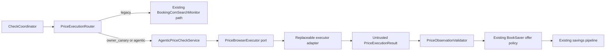

# Technical Design: Agentic Executor Control Plane

## Architecture Pattern

Use the existing single-process hexagonal architecture. A domain-only browser-execution model is
consumed through an application port; adapters implement provider/browser mechanics. A control-plane
service validates executor evidence before the existing offer/equivalence and savings pipeline.



This bolt creates the seams and pure policy. It does not route a production check to an executor.

## Layer Structure

### Domain

New module `booksaver.domain.browser_executor`:

- Closed enums for terminal status, refundability evidence, evidence completeness, route, validation
  rejection, and qualification status.
- Frozen value objects for trusted query, limits, lease reference, observed facts/offers, redacted
  provenance, usage, execution result, validation result, routing context, and qualification state.
- Pure `validate_price_observation()` and `resolve_execution_route()` services.
- Constructors reject invalid/secret-bearing shapes early and keep all costs in integer micro-USD.

No provider imports, browser APIs, cookies, prompts, or persistence dependencies are permitted.

### Application

New module `booksaver.application.browser_executor`:

- `AgenticPriceCheckService`: invoke executor, validate result, reconcile budget, and return a
  validated observation/rejection to the monitor.
- `InMemorySessionLeaseBroker`: process-local, lock-protected, single-use lease registry. It stores
  an opaque callback/capability rather than exposing bytes through the executor request.
- `FakePriceBrowserExecutor`: deterministic test/qualification adapter with queued results and
  captured content-free requests.
- Budget adapter protocol for reserve/reconcile so existing model-policy persistence can be wired in
  the next bolt without duplicating daily authority.

Extend `booksaver.application.ports` with `PriceBrowserExecutor` and `SessionLeaseBroker` protocols
that traffic only in domain types.

### Infrastructure

No production provider adapter is added in bolt 050. Bolt 051 implements Stagehand/Anthropic and a
local session-runtime capability behind the new ports.

### Presentation/Configuration

Add strict route parsing with `legacy` as the absent default. Explicit unknown values are rejected.
Do not expose a CLI promotion command in this bolt; qualification/promotion is unit 003 work.

## Executor Contract

### Request

`PriceExecutionRequest` contains:

- `execution_id`, `owner_user_id`, `booking_id`.
- `TrustedPriceQuery` containing trusted property reference/name, dates, occupancy, and currency.
- `SessionLeaseReference` containing only an opaque ID, owner/booking/execution binding, and expiry.
- `ExecutionLimits` containing an absolute monotonic/wall deadline, remaining actions, computer-use
  action ceiling, and cost reservation in micro-USD.

The request has no arbitrary URL, raw cookie/session field, credential field, prompt, or provider
configuration.

### Result

`PriceExecutionResult` contains:

- One closed terminal status.
- Optional observed query facts and zero or more `ObservedOffer` values.
- Redacted provenance made only of closed source/method identifiers and evidence counters.
- `ExecutionUsage`, latency, fallback-used flag, and refreshed-session eligibility boolean.

The result object rejects observation data for incompatible terminal states and rejects successful
observation state without facts/offers.

### Port

```python
class PriceBrowserExecutor(Protocol):
    def execute(self, request: PriceExecutionRequest) -> PriceExecutionResult: ...
```

The synchronous application port matches the daemon. Bolt 051 hides Stagehand's async API behind one
dedicated runner thread and returns through this port.

## Validation Pipeline

1. Require `OBSERVED` status and complete observed query facts.
2. Match exact stable property reference when both sides have one; otherwise use normalized property
   name under existing exact property rules. Never accept a conflicting stable reference.
3. Require exact check-in/out dates and occupancy.
4. Require explicit authenticated context. Genius may be unknown but is recorded as provenance, not
   substituted for authentication.
5. Require each offer to have explicit expected currency, positive all-in total, complete evidence,
   explicit refundable status, and non-empty refundability text.
6. Convert only these qualified observations into the existing offer-policy input shape. Room
   equivalence remains a separate existing policy step and cannot be supplied by the executor.
7. If no offer survives, return a typed rejection without updating savings/persistence state.

Validation returns all rejection codes internally but exposes only content-free codes to metrics.

## Session Lease Design

`SessionLeaseReference` is data; session material lives in `SessionLeaseBroker` entries. A broker
entry contains:

- Immutable owner/booking/execution/expiry binding.
- A single-use local restore capability implemented in infrastructure.
- An optional same-browser refresh capability that performs code-owned authentication verification
  before returning encrypted-persistence eligibility.
- A mandatory close capability.

The executor adapter receives the broker by dependency injection and consumes by opaque reference.
It never receives a `bytes`, cookie list, or storage-state value through its public API. Broker close
is idempotent and invoked in an application `finally` block as a second safety net around adapter
cleanup.

## Routing Design

`resolve_execution_route(configured, context)` is pure and fail closed:

- `legacy`: everyone uses legacy.
- `owner_canary`: owner uses agentic; every non-owner uses legacy.
- `agentic`: owner uses agentic. An invitee uses agentic only when qualification is current, no
  critical regression is active, and acknowledgement equals the current disclosure version;
  otherwise legacy.
- Missing route config: legacy.
- Invalid explicit route value: configuration error at startup.

The resolver returns the effective route plus a closed reason for auditability. It never starts a
browser or mutates qualification state.

## Budget and Limit Design

- `ExecutionLimits` enforces the approved hard maxima at construction.
- `AgenticPriceCheckService` reserves the full admitted per-job exposure before executor invocation.
- Adapter calls report token usage and calculated/actual micro-USD; actual cannot exceed reserved.
- Reconciliation happens in `finally`, including provider exceptions and timeouts.
- One `ActionCounter` counts semantic and computer-use actions; the latter also has a nested ceiling
  of six.
- Existing deployment-day persistence remains the single dollar authority; the new service consumes
  a small reserve/reconcile port rather than maintaining another counter.

## Error Handling

- Expected executor outcomes remain values, not exceptions.
- Provider/runtime bugs become `PROVIDER_FAILURE` at the adapter boundary with no exception text in
  persisted provenance.
- Lease mismatch/expiry/duplicate consumption returns `SESSION_UNAVAILABLE` and no browser launch.
- Validation ambiguity returns a typed rejection and preserves prior savings/session state.
- Budget and cleanup invariant failures are terminal and eligible for owner-only content-free
  incident reporting.

## Security and Privacy Design

- Frozen explicit types prevent arbitrary provider payloads from reaching domain logic.
- No generic `dict[str, Any]` is accepted at the executor port.
- String fields are length-bounded and normalized; provenance uses closed enums and integer counts.
- Result/session dataclasses use field names that make accidental cookie/page-content inclusion
  mechanically testable.
- Fake executor `repr` and captured requests contain no lease material.
- No result or error stores page text, screenshots, accessibility trees, prompts, responses, or
  model reasoning.

## Persistence

Bolt 050 adds no schema migration. Routing is configuration/policy; qualification persistence and
redacted execution metrics are designed and implemented in bolt 052. Existing session storage,
check history, traces, and model-policy cost ledger remain authoritative.

## Integration Points

- **Coordinator**: supplies authorized owner/booking identity and holds the existing global browser
  lease before either route runs.
- **Session service**: issues local lease capabilities from already-authorized per-user state.
- **Legacy monitor**: unchanged default and rollback implementation.
- **Offer pipeline**: receives only validated observation inputs and retains equivalence/savings
  authority.
- **Model policy**: supplies approved model/pricing and persistent dollar admission.

## Testing Strategy

### Contract tests

- Construct every terminal status and reject invalid status/data combinations.
- Prove request/result serialization surfaces cannot carry session material or content-bearing fields.
- Validate limits and non-negative/exact micro-USD arithmetic.

### Validation tests

- Individually vary/miss/conflict property, dates, occupancy, authentication, currency, all-in, and
  refundability evidence.
- Confirm a valid observation remains non-equivalent until existing room policy evaluates it.
- Confirm mixed valid/invalid offers retain only valid candidates; zero survivors fail closed.

### Lease tests

- Owner/booking/execution mismatch, duplicate consumption, expiry, close-on-error, and idempotent
  cleanup.
- Refreshed-session eligibility only after code verifier success.

### Routing tests

- Complete role/mode/qualification/consent matrix; absent config defaults legacy and invalid config
  fails startup.

### Accounting tests

- Exact reservation/reconciliation on success, typed failure, exception, timeout, and partial usage.
- Boundaries for 15/6 actions, 180 seconds, USD 1/check, and USD 10/day.

## Migration Safety

Bolt 050 can be merged with no production behavior change because:

- No default is changed.
- No provider adapter is constructed by runtime composition.
- No database schema changes.
- Existing monitor/coordinator interfaces remain source-compatible.
- New functionality is exercised only by pure/unit tests and explicit fakes.

## Story Coverage

- **US-143**: contract, port, fake, closed outcomes.
- **US-144**: validator and offer-policy boundary.
- **US-145**: lease reference/broker lifecycle.
- **US-146**: route resolver and exact limit/accounting seams.

## Completion Checklist

- [x] Hexagonal architecture and layer responsibilities are explicit.
- [x] Provider-neutral API contracts are defined.
- [x] No new persistence schema is required for bolt 050.
- [x] Security, privacy, cost, timeout, cleanup, and migration NFRs are addressed.
- [x] All four stories have a concrete implementation/test path.
