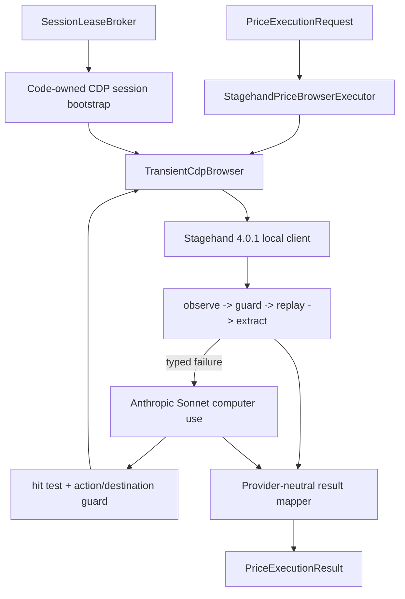

# Technical Design: Local Agentic Price Executor

## Architecture Pattern

Implement the port from bolt 050 with a thin orchestration adapter around replaceable local runtime
and model ports. Keep third-party Stagehand and Anthropic schemas inside infrastructure. The daemon
and monitor remain synchronous; one dedicated event-loop thread owns all async Stagehand work.

## Dependency and Packaging

- Add exact runtime pin `stagehand==4.0.1` with ADR-037.
- Retain `playwright` for executable discovery, existing legacy routing, session serialization, and
  `/connect`; do not install a second Chromium.
- Retain the existing `anthropic` dependency and `BOOKSAVER_LLM_API_KEY`; add no secret.
- Stagehand is imported lazily by its adapter so `legacy` mode can start and operate even if the
  optional runtime is unavailable. Selecting an agentic route without the dependency fails closed
  before session restoration.
- Docker continues installing Playwright Chromium; the runtime receives its exact executable path.

## Layer Structure

### Domain additions

Add a provider-neutral guarded-action module containing:

- Semantic/visual action enums and typed proposals.
- Destination/hit-test evidence with bounded content.
- Closed rejection/semantic terminal codes.
- Pure action/destination guard shared by Stagehand and computer use.

### Application additions

- `AsyncLoopRunner`: daemon-owned event-loop thread with one bounded `run(coroutine, timeout)` call,
  cancellation propagation, and deterministic close.
- `PriceCheckRouter`: resolve route, invoke legacy or agentic path, never both, and expose content-free
  routing reason.
- Observation-to-offer adapter: exact room labels are code-qualified; non-exact labels may use the
  existing separately injected semantic equivalence policy, but the executor cannot set match flags.

### Infrastructure additions

- `TransientCdpBrowser`: launch exact Chromium with a temporary profile and loopback CDP endpoint,
  connect a code-owned Playwright bootstrap for session restore/read-back, and tear down process/profile.
- `StagehandRuntime`: attach Stagehand to the already-bootstrapped CDP browser, observe action
  candidates, replay only guarded candidates, typed-extract observations, screenshot, hit-test, and
  execute guarded primitives.
- `AnthropicComputerUseClient`: one Sonnet 5 tool-use loop with only the computer tool plus typed
  `submit_price_observation` and `submit_terminal_outcome` tools.
- `StagehandPriceBrowserExecutor`: orchestrate semantic lane, optional fallback, terminal mapping,
  usage/cost, and cleanup.

### Presentation additions

- Extend `/connect` copy with the disclosure version. Invitee acknowledgement persistence and
  promotion admission are completed in bolt 052; absence of acknowledgement remains legacy.

## Browser and Session Custody

1. Resolve the installed Playwright Chromium executable before consuming a lease.
2. Create a mode-0700 temporary directory and launch Chromium with a loopback-only CDP port, fresh
   profile, mobile viewport/user-agent settings, no downloads, and no remote service.
3. A code-owned Playwright CDP connection implements `SessionRestoreTarget`. The lease broker pushes
   the opaque storage-state bytes directly into this bootstrap; the bytes are never passed through a
   Stagehand/Anthropic constructor, prompt, request, result, or log.
4. Close the bootstrap connection without closing Chromium.
5. Attach Stagehand to the existing CDP endpoint. Stagehand can observe authenticated page state but
   does not receive cookie values as application data.
6. After an observed execution, a code-owned Playwright connection probes the fixed protected
   Booking.com account resource twice using the existing server-authentication contract. Only then
   may it capture cookies into the owner-bound lease and set `refreshed_session_eligible`; the
   application removes those bytes before returning the provider-neutral result and persists them
   through the encrypted session repository with revision compare-and-replace.
7. Terminate Chromium and delete the transient directory in `finally`; broker close is a second
   safety net.

Tests use fake runtime ports rather than launching authenticated live browsers. A local CDP smoke test
uses synthetic cookies only.

## Semantic Execution

### Trusted entry

BookSaver constructs the same code-owned Booking search URL from property, dates, occupancy, and
currency. The runtime may navigate directly to that trusted HTTPS Booking URL; models cannot provide
or modify URLs.

### Observe/guard/replay loop

For each goal phase, at most the remaining shared action count:

1. Stagehand `observe` receives one bounded instruction and returns candidate action descriptors.
2. The adapter selects the first candidate, translates it to `SemanticActionPreview`, and checks:
   current top-level URL, action kind, role/label, href/destination, arguments, popup count, and
   protected/transaction patterns.
3. If approved, increment the shared action meter and pass the exact observation action object to
   Stagehand `act`; this replays the deterministic candidate without another natural-language action
   request.
4. Re-observe destination facts and reject unexpected host/path/popup changes.
5. Stop the phase when a code-owned readiness check based on typed extraction succeeds, or return a
   closed semantic failure.

Stagehand direct instruction actions, cross-run caching, self-heal persistence, generated scripts,
and selector logging are not called.

### Typed extraction

Use a bounded schema that mirrors, but does not import, BookSaver domain types:

- Observed property name/reference.
- Check-in/out, adults/children/rooms, currency, authenticated and Genius indicators.
- Offers with visible room label, decimal total, currency, explicit all-in state,
  refundability state/text, and evidence completeness.

The adapter performs strict structural/type/length/decimal/date validation before constructing the
provider-neutral result. It does not request or accept equivalence/savings fields.

## Guarded Computer Use

### Provider request

- Model: `claude-sonnet-5` only.
- Official computer-use beta/tool version supported by the installed Anthropic SDK.
- Tools: computer display plus `submit_price_observation` and `submit_terminal_outcome`; no bash,
  text editor, filesystem, URL/navigation, clipboard, credential, MFA/captcha, download/upload, or
  transaction tools.
- Each turn contains the goal, trusted non-secret query facts, closed prior guard result, and current
  screenshot. Never include cookies, storage state, headers, page source, accessibility tree, or
  persisted reasoning.

### Accepted actions

- Screenshot requests do not count as browser mutations.
- `left_click`: require integer in-viewport coordinates and code-owned `elementFromPoint` hit test.
- `scroll`: clamp deltas to one viewport and reject horizontal/excessive values.
- `type`: require a currently focused safe search/filter input and bounded non-secret value derived
  from the trusted query; arbitrary model strings are rejected.
- `key`: allow a fixed navigation key set only; reject shortcuts, clipboard, devtools, downloads,
  submits on unsafe controls, and OS keys.
- `wait`: clamp to a short bounded duration.
- `zoom`: clamp to approved percentages and viewport-only semantics.

Each accepted mutation consumes one of six visual actions and one of 15 total actions. Before and
after each action, enforce Booking HTTPS host/path, popup, and transaction policy.

### Typed termination

`submit_price_observation` is mapped through the same strict extraction schema. The terminal tool
accepts only closed outcomes: signed out, MFA, captcha, bot wall, unavailable, no observation,
provider failure, budget, or timeout. Free-form assistant text cannot terminate successfully.

## Guard Policy

Reuse existing action-safety concepts but keep executor guards generic:

- Approved hosts: exact Booking.com apex/subdomains under HTTPS; loopback only for CDP/telemetry.
- Reject URL userinfo, non-default ports, external redirects, unrecognized popups, `javascript:`,
  `data:`, `blob:`, downloads, and non-HTTPS navigation.
- Reject labels/paths associated with reserve/book/pay/buy/checkout/cancel/delete/change/confirm
  reservation, sign-in credential submission, MFA, captcha, and account mutations.
- Reject form submits except safe search/date/occupancy controls whose values come from the trusted
  query.
- Guard rejection is terminal for the episode; no model is asked to work around the guard.

## Anthropic Usage and Cost

- All Stagehand semantic calls and computer-use turns use the existing `BrowserJobCostBudget` and
  Sonnet 5 price table. Every call reserves before provider invocation and reconciles actual usage or
  conservative exposure on provider failure.
- Opus routing APIs are not supplied to this adapter.
- The execution meter combines provider actions/calls and refuses the next operation before any
  15/6/180-second/USD 1 limit can be exceeded.
- Deployment-day USD 10 admission remains in the existing SQLite model ledger.

## Telemetry, Logging, and Egress

- Construct Stagehand with external logging disabled and telemetry disabled where supported. If the
  pinned release requires a telemetry endpoint, use an in-process loopback no-op sink and never an
  external default.
- Configure the adapter logger for content-free execution IDs, closed codes, counts, latency, and
  usage only.
- Never persist screenshots, page text/HTML/tree, action selectors, prompts, provider responses,
  cookies, headers, or model reasoning.
- A socket/HTTP qualification fixture records destinations and fails unless every destination is
  Booking.com, Anthropic, or loopback.

## Routing Integration

- `BookingComSearchMonitor` receives an optional `AgenticPriceExecutionService`, owner ID, and
  effective route decision.
- Legacy path remains byte-for-byte behavior for `legacy` and all degraded invitee decisions.
- Agentic path replaces both `SearchJourney` navigation and DOM/LLM rate extraction. It supplies
  validated offers to a BookSaver-owned equivalence adapter, then reuses existing cheapest-offer,
  provenance, check-result, trace, session, and savings integration.
- Never run legacy as an automatic fallback after an agentic execution. A failure is recorded
  fail-closed; legacy is a configuration/rollback route, not an unbounded second browser job.

## Disclosure Integration

Disclosure version `anthropic-visible-booking-page-v1` states that the deployment owner's configured
Anthropic account may process visible authenticated Booking.com content and escalation screenshots;
cookies/credentials remain local, execution is read-only, and BookSaver retains validation. It is
shown before `/connect` begins for invitees. Bolt 052 adds durable acknowledgement and qualification
admission; until then, invitee agentic routing cannot pass.

## Test Design

- Runtime lifecycle: executable discovery, synthetic cookie bootstrap/read-back, Stagehand attach to
  same CDP, cleanup on all terminal paths.
- Semantic adapter: preview guard, exact replay, typed schema, no direct action/cache/self-heal calls.
- Computer use: all approved actions, every forbidden action/tool/path/label, hit-test edge cases,
  popup/destination drift, six-action ceiling, typed submission/terminal only.
- Terminal mapping: signed out, MFA, captcha, bot wall, unavailable, provider error, budget, timeout.
- Privacy: prompts/results/logs/repr contain no synthetic secret; screenshots are ephemeral.
- Routing: legacy default unchanged, owner canary only, invitee consent gate remains closed.
- Packaging: exact pin, existing Chromium executable, lazy import behavior, Docker install smoke.

## Story Coverage

- **US-147**: async runner, transient CDP runtime, local session bootstrap, cleanup.
- **US-148**: observe/guard/replay and typed extraction.
- **US-149**: Sonnet computer-use loop, hit test, closed tools/limits/terminal mapping.
- **US-150**: telemetry/egress/log redaction, disclosure, and consent-safe routing.

## Completion Checklist

- [x] Architecture/layers and third-party containment are explicit.
- [x] Browser/session ownership and same-browser handoff are concrete.
- [x] Semantic and visual contracts, guards, usage, and terminal behavior are defined.
- [x] Privacy, packaging, routing, testing, and rollback NFRs are addressed.
