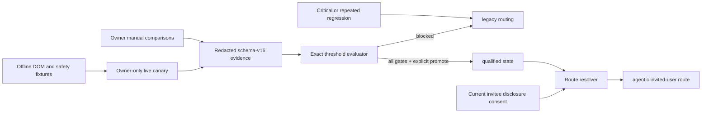

# Technical Design: Agentic Browser Qualification

## Persistence

Schema v16 adds three local tables:

- `agentic_canary_checks` stores only bounded metrics, closed violations, and manual verdicts;
- `agentic_promotion_state` stores the singleton state, policy version, owner approval, rollback
  deadline, and regression code;
- `agentic_disclosure_consents` stores one current version/time per invited user.

All repositories enforce active-owner or active-invitee authority before mutation. Promotion ignores
caller-supplied metrics and evaluates the stored canary in the same transaction scope.

## Qualification Flow

## Offline Qualification

The fixture corpus changes CSS classes, test IDs, nesting, overlays, iframe/shadow placement, and
accessibility quality. Provider-emitted semantic selectors are opaque adapter tokens; BookSaver
does not learn or cache them. Overlay, iframe/shadow, and poor-accessibility cases are forced through
the guarded same-browser visual path. Closed terminal fixtures cover signed-out, MFA, captcha, bot
wall, unavailable, invalid observation, provider failure, budget, and timeout outcomes.

The egress policy classifies only HTTPS Booking.com, HTTPS `api.anthropic.com`, and loopback HTTP,
WebSocket, or CDP endpoints. Stagehand browser navigation has a Booking domain policy, its trace
endpoint is a loopback discard server, and the direct Anthropic client has an explicit base URL.

## Operator Controls

`booksaver agentic status`, `compare`, `promote`, and `regress` expose only local redacted state.
`promote` fails unless the repository's live evidence passes every gate. `/connect` records current
versioned disclosure consent before starting the existing secure login flow for an invited user.

## Live Boundary

Construction stops at `live-owner-canary`. Tests may prove threshold behavior with synthetic data,
but cannot change the production qualification state without the local owner's explicit command and
authentic persisted check IDs.
