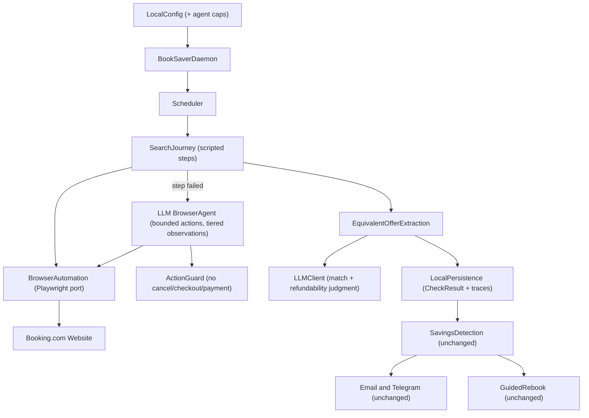

# System Context: Agentic Search Monitor

## Intent

Replace the manage-page price check with a hybrid agentic search-journey flow: on every scheduled
check the daemon re-searches the registered property and dates on Booking.com as a returning customer,
extracts the all-in bookable total for an equivalent refundable room, and feeds it to the existing
savings-detection → notification → guided-rebook pipeline unchanged.

## Actors

- **User:** Individual running the daemon locally; sets occupancy at registration; reviews traces on failure.
- **Booking.com:** External website reached through the full search journey (search box → results →
  property page → room table) via browser automation with the saved session. No official API.
- **LLM provider (Anthropic API):** Two roles now — (a) judgment calls during extraction
  (room-type match, refundability wording), and (b) a **browser agent** that takes over individual
  journey steps when the scripted path fails, using tiered observations (text/DOM first, screenshot
  escalation) and a bounded action vocabulary.
- **Email provider / Telegram:** Unchanged notification channels.

## System Boundary

Unchanged from intent 001: single-process local daemon; all data, sessions, traces, and snapshots stay
on the user's machine. LLM API calls carry page content only — never cookies or credentials.

## Primary Runtime Collaborators

## Core Constraints

- All intent-001 product constraints remain: Booking.com hotels only, refundable only, pragmatic
  equivalence (same property, dates, room type, still refundable), no autonomous cancel/purchase,
  local-only.
- The search journey is strictly **read-only on the account**: an action guard prevents the agent (and
  scripts) from entering cancellation, checkout, or payment flows.
- The manage page is no longer a price source; it remains only for session validation.
- Hard per-check caps (agent steps, LLM calls, wall-clock) — deliberately simple; adaptive budgeting is
  documented future work.
- Occupancy is explicit per booking (required at registration; migrated bookings must be backfilled
  before checks succeed).

## Current Repository State

MVP complete (intents 001, bolts 001–005, 211 tests). This intent modifies unit
`002-booking-com-price-monitor`'s runtime slot (monitor + browser/LLM adapters), extends registration
(`001-core-local-data` surface) with occupancy, and must leave units 003/004 interfaces untouched.
