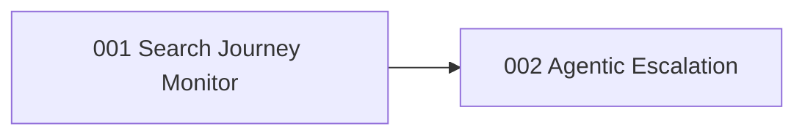

# Units: Agentic Search Monitor

## Unit Decomposition

Two units, built in order. Unit 1 delivers a working scripted search-journey monitor end-to-end
(occupancy capture, full journey, equivalent-offer extraction, savings-pipeline integration) — it is
independently valuable: on a good day the scripted path finds real savings with at most two LLM
judgment calls. Unit 2 layers the agentic escalation on top (LLM browser agent, safety guard, hard
caps, diagnosability), which is what makes the journey survive UI drift.

| Unit | Responsibility | Stories | Depends On | Build Order | Status |
|------|----------------|---------|------------|-------------|--------|
| `001-search-journey-monitor` | Occupancy at registration; scripted full search journey; equivalent-offer extraction; replace manage-page price source | US-017, US-018, US-019 | intent-001 units 001–003 (existing code) | 1 | Complete |
| `002-agentic-escalation` | LLM browser-agent step takeover (tiered observations); action guard + hard cost caps; step traces + failure snapshots + CLI | US-020, US-021, US-022 | 001-search-journey-monitor | 2 | Planned |

## Cross-Cutting Constraint

US-013 (operate without a BookSaver cloud) from intent 001 applies unchanged: traces, snapshots,
sessions, and check history stay local; LLM calls carry page content only.

## Completion Gate

All 6 new stories (US-017 – US-022) assigned exactly once. Downstream units of intent 001
(savings detection, notifications, guided rebook) require no interface changes; their existing tests
keep passing throughout.
