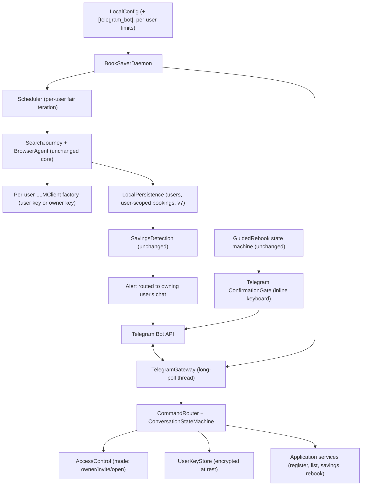

# System Context: Telegram Interface

## Intent

Turn the one-way Telegram alert channel into the primary, bidirectional user interface. The daemon
runs unattended on an owner-operated VPS; users register bookings, review savings, manage their
Anthropic API key, and confirm rebook steps entirely in Telegram chat.

## Actors

- **Owner:** Operates the VPS and the bot; allowlisted; may use the owner's own LLM key; has admin
  commands (list/revoke users, set access mode).
- **Guest user:** Anyone who discovers the bot (in `open` mode). Must provide their own Anthropic API
  key before any LLM-consuming feature unlocks. Owns only their bookings and alerts.
- **Telegram Bot API:** Inbound commands via long polling (`getUpdates`), outbound messages/inline
  keyboards (`sendMessage`, `editMessageText`, `deleteMessage`). stdlib urllib, certifi CA bundle.
- **Booking.com:** Unchanged — reached via Playwright search journey, now headless on the VPS,
  logged-out by default.
- **Anthropic API:** Per-user keys for guests; owner key (env var) for owner bookings.

## System Boundary

Single-process daemon on an owner-operated VPS: scheduler thread + Telegram update-loop thread.
All data (SQLite, traces, snapshots, encrypted user keys) stays on the VPS — there is still **no
BookSaver cloud**. This amends the MVP "user's machine" boundary to "owner's machine (VPS)"; laptop
single-user mode remains fully supported (bot disabled or owner-only).

## Primary Runtime Collaborators

## Core Constraints

- All product constraints unchanged: Booking.com hotels only, refundable only, pragmatic equivalence,
  **no autonomous cancel/purchase**.
- Rebook's final booking click happens on the **user's device** via deep link — never in the VPS
  browser.
- Guests' LLM costs are billed to their own key; VPS/browser compute is protected by per-user daily
  caps and rate limits on top of ADR-017 per-check caps.
- User API keys: encrypted at rest, redacted everywhere, deletable by the user.
- Repository-level user scoping — cross-user data access impossible by construction.
- Bot layer is an inbound adapter only; all business rules stay in existing application/domain layers
  (CLI and bot share one registration/rebook code path).

## Current Repository State

Intents 001–002 complete (bolts 001–007, 360 tests). Telegram exists only as an outbound
`TelegramNotifier` (single hardcoded chat). Registration, occupancy backfill, checks inspection, and
rebook confirmation are CLI-only. Schema at v6. This intent adds a users table + scoping (v7), a bot
gateway package, a key store, a Telegram confirmation-gate adapter, and deployment artifacts under
`memory-bank/operations/`.
