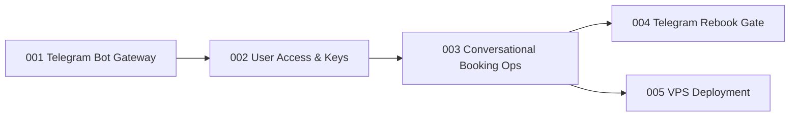

# Units: Telegram Interface

## Unit Decomposition

Five units, built in order. Unit 1 gives an immediately useful owner-only bot (read/inspect commands)
without touching the schema. Unit 2 is the multi-user pivot (users table, access modes, BYO keys).
Unit 3 makes the bot the full write-path (conversational registration, per-user alerts and limits).
Unit 4 moves rebook confirmation to Telegram. Unit 5 makes the whole thing run unattended on a VPS.

| Unit | Responsibility | Stories | Depends On | Build Order | Status |
|------|----------------|---------|------------|-------------|--------|
| `001-telegram-bot-gateway` | Long-poll update loop in daemon; command router + conversation state machine; read-only commands (`/status`, `/bookings`, `/savings`, `/checks`); owner-chat-only safety default | US-023, US-024, US-036 | intents 001–002 (existing daemon, stores, notifier) | 1 | Planned |
| `002-user-access-and-keys` | `users` table + user-scoped repositories (schema v7); access modes owner/invite/open; BYO Anthropic key intake, validation, encryption at rest, redaction; per-user LLM client factory; owner admin commands | US-026, US-027, US-028, US-029 | 001 | 2 | Planned |
| `003-conversational-booking-ops` | `/register` guided dialog reusing CLI application path; savings alerts routed to owning user's chat; per-user daily caps + rate limits + fair scheduling | US-025, US-030, US-031 | 002 | 3 | Planned |
| `004-telegram-rebook-gate` | Telegram `ConfirmationGate` adapter (inline keyboards) for the unchanged rebook state machine; device-handoff deep link for the final booking click; audit trail with message IDs | US-032, US-033 | 003 | 4 | Planned |
| `005-vps-deployment` | Dockerfile/systemd deployment, ops runbook in `memory-bank/operations/`; logged-out headless session strategy; optional cookie import for member rates | US-034, US-035 | 003 (usable after 001 for owner-only) | 5 | Planned |

## Cross-Cutting Constraints

- New ADR (proposed ADR-018) amends US-013's "local-only" wording: self-hosted owner-operated VPS is
  an accepted deployment mode; still no BookSaver cloud. Laptop mode unchanged.
- Bot layer is an inbound adapter — CLI and bot call the same application services; no domain logic in
  the gateway.
- No autonomous cancel/purchase; final booking click never happens on the VPS.

## Completion Gate

All 14 new stories (US-023 – US-036) assigned exactly once. Existing 360 tests keep passing; CLI
remains fully functional for laptop mode; single-user laptop deployment behaves identically after the
v7 migration (owner is the sole user).
