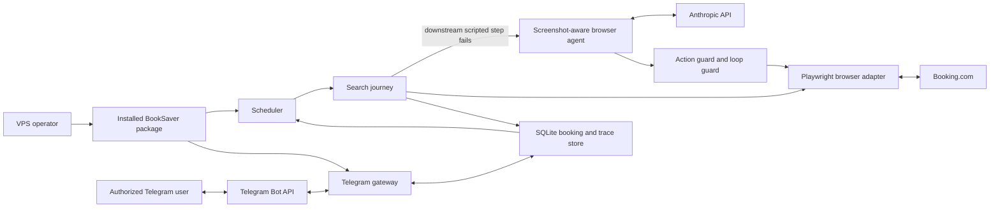

# Production Hardening - System Context

## System Overview

BookSaver remains one self-hosted Python daemon with a scheduler, Telegram gateway, Playwright
browser automation, an Anthropic-backed browser agent, and local SQLite persistence. This intent
hardens the seams revealed by a real VPS check: agent recovery from Booking.com layout drift,
trusted-data continuation after bounded recovery fails, completeness of the packaged persistence
resource, and consistency of Telegram's command and identifier surface.

The second live VPS trace refined the journey boundary: trusted search-results navigation is now the
primary entry, while the LLM remains the adaptive layer for result, property, room-view, and offer
interpretation drift. The homepage form is no longer an active automation dependency.

## Actors

- **VPS operator** (Human): Deploys and updates BookSaver, observes logs and traces, and expects the
  installed artifact to start against a persistent data volume.
- **Authorized Telegram user** (Human): Registers bookings, discovers commands, inspects status and
  checks, and may use the short booking identifier displayed by the bot.
- **Scheduler** (System): Starts a check from persisted booking data and records its outcome.
- **Browser agent** (System): Uses Anthropic reasoning over text and screenshot observations to
  recover a failed scripted journey step through guarded Playwright actions.

## External Systems

- **Booking.com**: Outbound browser navigation and read-only price discovery. Its DOM and calendar
  layout may change without notice.
- **Anthropic API**: Outbound tool-use decisions for recovery and offer interpretation. Model output
  is untrusted until validated by the action guard and journey invariants.
- **Telegram Bot API**: Inbound commands and outbound help, status, and check-history messages.
- **Python package installer / Docker build**: Installs the wheel used by the VPS container; the wheel
  must carry non-Python runtime resources.

## System Boundary and Data Flows

### Inbound

- Registered booking property, dates, room type, price, currency, refundability, and occupancy from
  an authorized Telegram/CLI flow into SQLite.
- Telegram command text and caller identity from Telegram's update metadata.
- LLM action proposals based on current browser observations.
- Booking.com page content and screenshots captured by Playwright.

### Outbound

- Guarded read-only browser actions and exact search URLs sent to Booking.com.
- Redacted text and screenshot observations sent to Anthropic.
- User-scoped help, status, and check-history responses sent through Telegram.
- Check results and trace events written to local SQLite persistence.

## Context Diagram

## High-Level Constraints

- The LLM is the primary adaptive recovery path for layout drift, but it cannot expand its own
  authority: browser actions remain allowlisted and destructive actions remain forbidden.
- Search entry uses Booking.com's results URL built from persisted data; homepage form interaction is
  not a prerequisite, and the registered property URL is not used as a direct price-source shortcut.
- Exact booking dates and occupancy originate only from persisted booking data.
- A recovery continuation cannot skip property/context verification or offer-equivalence rules.
- Telegram booking lookup is always scoped to the authenticated Telegram user.
- Runtime resources must be present in the installed distribution, not read from a source checkout.
- No BookSaver-hosted service or additional runtime process is introduced.

## Key NFR Goals

- Intervene after at most two identical successful-but-unverified browser executions.
- Preserve zero autonomous reserve, checkout, payment, or cancellation actions.
- Preserve zero cross-user booking-prefix disclosures.
- Ship a wheel that contains `schema.sql` and passes the complete automated and static quality gates.
