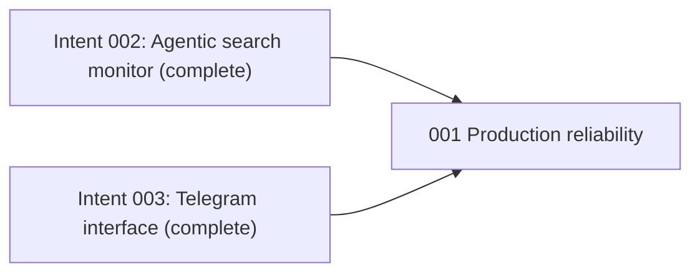

# Production Hardening - Unit Decomposition

## Units Overview

This intent decomposes into one cohesive CLI-tool unit. The four requirements cross runtime seams,
but they share one deployability objective and must be regression-tested together against the same
daemon distribution.

### Unit 1: `001-production-reliability`

**Description**: Harden the browser agent's layout-drift recovery, provide a safe trusted-data
continuation for the search form, make the installed package self-contained, and align Telegram's
documented and accepted identifiers.

**Assigned requirements**: FR-1, FR-2, FR-3, FR-4 (all requirements assigned exactly once).

**Stories**:

- US-037: Adapt after repeated browser actions.
- US-038: Continue `fill_search` from trusted booking data.
- US-039: Package the persistence schema.
- US-040: Discover commands and use displayed booking identifiers.

**Deliverables**:

- Bounded screenshot-aware agent recovery and traces.
- Safe exact-data search continuation with normal downstream verification.
- Wheel package-data declaration and packaging regression test.
- Complete Telegram help plus user-scoped short-ID resolution.
- Automated regression evidence and AI-DLC construction artifacts.

**Dependencies**:

- Depends on intent 002's completed search journey and agentic escalation.
- Depends on intent 003's completed Telegram gateway and VPS deployment.
- No other unit depends on this intent during inception.

**Estimated Complexity**: M

## Requirement-to-Unit Mapping

| Requirement | Unit | Rationale |
|-------------|------|-----------|
| FR-1 | `001-production-reliability` | Changes bounded browser-agent recovery behavior |
| FR-2 | `001-production-reliability` | Changes the same search-journey failure path |
| FR-3 | `001-production-reliability` | Ensures the hardened daemon is deployable from its wheel |
| FR-4 | `001-production-reliability` | Aligns the deployed Telegram operational surface |

## Unit Dependency Graph

## Execution Order

1. Execute bolt `013-production-reliability` for all four cohesive hardening stories.
2. Review automated/static checks and built-wheel inspection.
3. After human approval and git delivery, rebuild and smoke-test the VPS container.

## Independence Validation

- **Single responsibility**: Production reliability of the completed VPS daemon.
- **Clear interface**: Existing `BrowserAgent`, `SearchJourney`, persistence package, and Telegram
  command adapter seams.
- **Independent verification**: Unit, journey, Telegram, packaging, lint, and type checks can run
  without a live production deployment.
- **Deployment boundary**: Ships as the same single BookSaver daemon image; no distributed unit is
  introduced.
