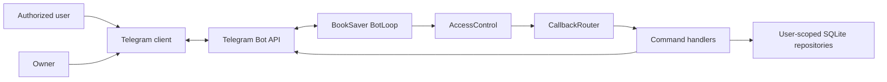

# Telegram Command Navigation - System Context

## System Overview

BookSaver remains one self-hosted daemon. This intent changes only the Telegram inbound adapter: it
publishes command metadata to Telegram and turns stored, authorized choices into inline keyboards.
All selected identifiers are treated as untrusted hints and re-resolved through existing scoped
repositories and confirmation gates.

## Actors

- **Authorized Telegram user**: Discovers commands and selects their bookings or savings.
- **Owner**: Receives the owner command scope and navigates protected admin actions.
- **Telegram client**: Displays command suggestions and inline keyboards, then sends callbacks.
- **Telegram Bot API**: Stores command definitions and transports messages/callback queries.
- **BookSaver daemon**: Authorizes callbacks, resolves local state, and executes existing handlers.

## Data Flows

### Inbound

- Slash commands and optional typed arguments.
- Callback query sender/chat identity, message ID, and bounded callback payload.

### Outbound

- Scoped command definitions through `setMyCommands`.
- Inline-keyboard messages and edited selection/results messages.
- Callback acknowledgements for every received button tap.

## Context Diagram

## External Integrations

- **Telegram Bot API**: `setMyCommands`, `sendMessage`, `editMessageText`, and
  `answerCallbackQuery` over the existing HTTPS client.

## High-Level Constraints

- Native command suggestions cover command names, not live argument completion.
- Every callback must be current-authorized and entity-scoped at execution time.
- Telegram discovery failure degrades to the existing `/help` and typed-command interface.
- No new service, database schema, webhook, or dependency is introduced.

## Key NFR Goals

- Zero cross-user selection disclosure.
- Zero unconfirmed admin mutation through the new UI.
- Full callback acknowledgement and typed-command compatibility.
