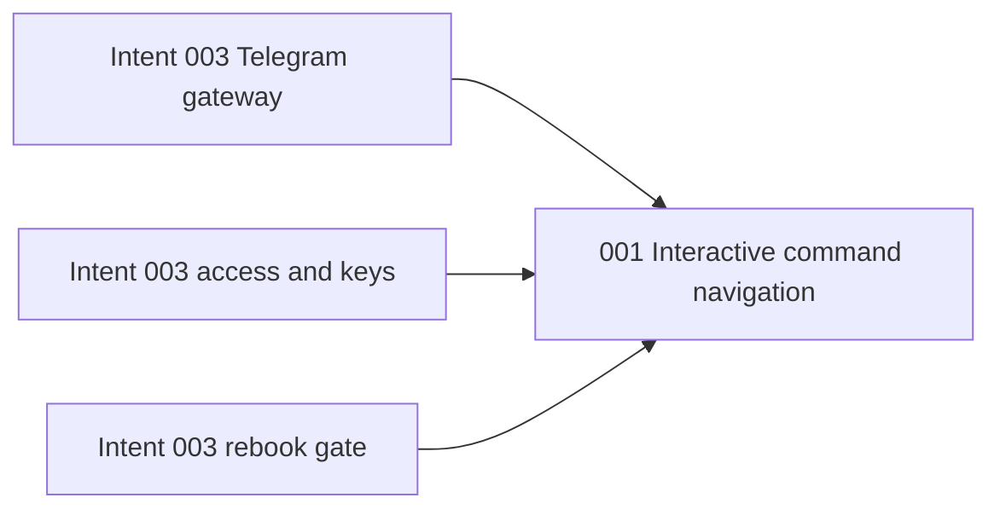

# Telegram Command Navigation - Unit Decomposition

## Units Overview

This CLI-tool intent has one command-based unit. Command metadata, callback dispatch, scoped pickers,
and admin navigation share one Telegram gateway deployment seam and one integration test surface.

### Unit 1: `001-interactive-command-navigation`

**Purpose**: Make every enumerable argument in the current Telegram command surface selectable while
preserving typed commands, access control, and existing services.

**Assigned requirements**: FR-1, FR-2, FR-3, FR-4, FR-5.

**Stories**:

- US-043: Discover applicable commands natively.
- US-044: Route and authorize interactive callbacks.
- US-045: Select bookings and savings opportunities.
- US-046: Navigate owner administration safely.
- US-047: Handle Boolean Telegram action results.

**Deliverables**:

- Scoped Telegram command publication.
- Reusable callback router and acknowledgement behavior.
- User-owned `/checks` and `/rebook` keyboards.
- Owner-only `/admin` action, target, choice, and confirmation keyboards.
- Regression and end-to-end gateway tests.

## Requirement-to-Unit Mapping

| Requirement | Unit | Rationale |
|-------------|------|-----------|
| FR-1 | `001-interactive-command-navigation` | Telegram command metadata is part of gateway wiring |
| FR-2 | `001-interactive-command-navigation` | Shared callback dispatch is the picker foundation |
| FR-3 | `001-interactive-command-navigation` | Booking/opportunity choices use scoped command handlers |
| FR-4 | `001-interactive-command-navigation` | Admin menus use the same guarded callback boundary |
| FR-5 | `001-interactive-command-navigation` | Telegram action response handling is a gateway adapter concern |

## Unit Dependency Graph

## Execution Order

1. Bolt `016-interactive-command-navigation` builds the original four cohesive stories.
2. Bolt `018-interactive-command-navigation` corrects the production callback-response defect.
3. Final human validation precedes deterministic completion and git delivery.
4. VPS rebuild validates command discovery and callback interaction in Telegram.

## Independence Validation

- **Single responsibility**: Navigation and choice collection for existing Telegram commands.
- **Clear interface**: Telegram command/callback updates in; existing handler operations out.
- **Independent verification**: Client, router, command, admin, rebook, loop, and gateway tests run
  without Telegram network access.
- **Deployment boundary**: Ships inside the existing daemon image.
