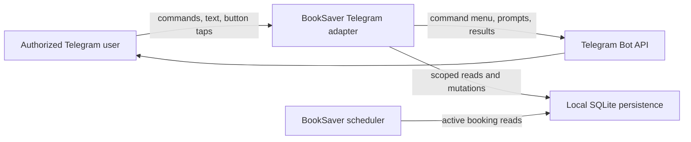

# System Context: Telegram Booking Management

## Actors

- **Authorized Telegram user**: Selects and mutates only their own active monitored bookings.
- **BookSaver daemon**: Routes commands/callbacks/dialog messages and schedules future checks from
  current SQLite state.
- **Telegram Bot API**: Transports command metadata, messages, and inline callback queries.
- **SQLite persistence**: Authoritative owner, booking, and booking-linked history store.

## System Boundary

This intent changes only BookSaver's Telegram inbound-adapter, application repository port, and
SQLite booking repository. It does not navigate Booking.com, cancel a reservation, or call any new
external system.

## Data Flows

### Edit

1. Telegram sends `/editbooking` or a typed booking selector.
2. BookSaver resolves the active local user and renders only their active bookings.
3. A callback selects a booking and an enumerated field group.
4. Dialog text is validated into existing domain value objects.
5. Completion re-resolves ownership and atomically updates the same booking row.
6. Subsequent scheduler repository reads observe the updated aggregate.

### Delete

1. Telegram sends `/deletebooking` or a typed booking selector.
2. BookSaver renders only caller-owned active bookings and a detailed confirmation screen.
3. A separate Confirm callback re-resolves the booking and ownership.
4. SQLite deletes dependent local rows and the booking in one transaction.
5. The booking no longer appears in scheduler reads or Telegram pickers.

## Context Diagram

## Trust Boundaries

- Callback payloads and typed IDs are untrusted selectors, never proof of ownership.
- Telegram display labels are presentation only; authoritative values are reloaded from SQLite.
- The global gateway access check is necessary but not sufficient; feature handlers also enforce
  caller ownership immediately before every mutation.
