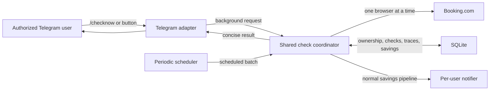

# System Context: Telegram On-Demand Checks

## Actors

- **Authorized Telegram user**: Selects one owned active booking and requests an immediate check.
- **Telegram gateway**: Admits commands/callbacks, renders pickers, and reports background outcomes.
- **Shared check coordinator**: Serializes all browser work and owns daemon-lifetime daily counters.
- **Scheduler**: Invokes the same coordinator for periodic fair batches.
- **Booking.com**: Supplies live public or authenticated availability and prices.
- **SQLite persistence**: Supplies current ownership/bookings and stores checks, traces, savings, and
  failure state.

## System Boundary and Flow

1. Telegram receives `/checknow`, optionally with a scoped booking selector.
2. The adapter resolves the caller and either renders an owned-booking picker or requests admission.
3. A background worker re-authorizes and re-resolves the booking.
4. The shared coordinator atomically checks shutdown, browser availability, duplicate state, and the
   user's remaining check/LLM budgets.
5. The normal Booking.com monitor records a trace and check result.
6. The normal savings pipeline evaluates and dispatches any owner-scoped alert.
7. Telegram receives a concise completion/failure message.

## Trust and Concurrency Boundaries

- Telegram selectors are never ownership proof; persistence is authoritative at selection and work
  execution time.
- The coordinator is the sole owner of browser admission and daily counters in the daemon process.
- Scheduler and Telegram threads may request work concurrently, so admission/counter operations are
  synchronized rather than relying on the GIL.
- External navigation can take minutes; it never runs on the Telegram polling thread.
