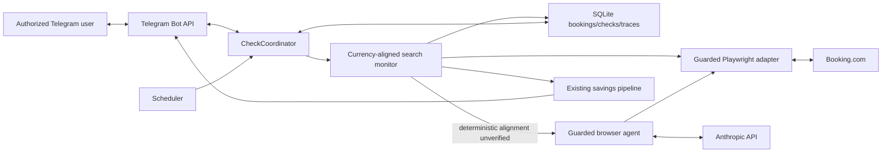

# Currency-Aligned Price Checks - System Context

## System Overview

BookSaver runs the existing read-only Booking.com search journey from an owner-operated VPS. This
intent makes the registered booking's baseline currency authoritative during navigation, verifies
the currencies actually rendered in candidate offers, and performs one bounded recovery when
Booking.com localizes an otherwise-equivalent refundable offer into a different currency.

The correction remains inside the current single-process monitor. It changes neither the booking
aggregate nor the downstream savings/rebook contracts: only a verified same-currency offer may
become a successful live price.

## Actors

- **Authorized Telegram user** (Human): Registers or edits the original all-in baseline, requests
  `/checknow`, and receives a current-price or actionable currency-mismatch result.
- **VPS operator** (Human): Deploys the daemon and diagnoses scheduled checks through logs/traces.
- **Scheduler / CheckCoordinator** (System): Starts serialized scheduled and on-demand checks under
  shared quotas, LLM budgets, browser exclusivity, and timeouts.
- **Search monitor** (System): Builds trusted URLs, verifies page context, extracts offers, aligns
  currency once when warranted, and emits a normal `CheckResult`.
- **Guarded browser agent** (System): May operate Booking.com's visible currency control only when
  deterministic alignment cannot be completed or verified, subject to existing caps and guards.

## External Systems

- **Booking.com**: Receives read-only search/property navigation and exposes localized currency
  preferences plus rendered room/rate content. URL and UI behavior may drift without notice.
- **Anthropic API**: Provides bounded browser-agent decisions for the optional visible-selector
  fallback and existing offer interpretation. Its output is untrusted until guard and verification.
- **Telegram Bot API**: Carries `/checknow` requests and final actionable outcomes.
- **SQLite**: Existing local persistence for booking baselines, checks, traces, and savings; no schema
  change is introduced.

## System Boundary and Data Flows

### Inbound

- Persisted booking property, dates, occupancy, room type, baseline amount, and ISO-4217 currency.
- Booking.com result links, rendered price/currency/refundability evidence, and visible controls.
- Optional guarded LLM action proposals when deterministic currency alignment is not verified.
- Scheduled ticks and authorized Telegram `/checknow` requests through the existing coordinator.

### Outbound

- Search-results and property URLs carrying trusted dates, occupancy, and baseline currency.
- At most one deterministic/agent-assisted currency-preference recovery cycle.
- Check history and trace events describing requested currency, observed currencies, recovery method,
  and terminal result.
- Telegram success, savings, or currency-specific failure messages through existing notification paths.

## Context Diagram

## High-Level Constraints

- The booking's original baseline currency is authoritative and is never converted or relabeled.
- Rendered candidate evidence, not a URL request alone, authorizes same-currency comparison.
- Recovery occurs only for an otherwise-equivalent, positively refundable mismatched candidate and
  can execute no more than once per check.
- Existing property, dates, occupancy, room, refundability, total-price, quota, timeout, and action
  guards remain authoritative.
- The LLM can adapt to visible currency-control drift but cannot decide exchange rates, override the
  desired currency, or waive verification.
- No third-party FX service, new database schema, new process, or new runtime dependency is added.

## Key NFR Goals

- Zero cross-currency savings opportunities or notifications.
- Zero recursive recovery and no reset of existing per-check budgets.
- Zero extra LLM calls for a normal same-currency check or successful deterministic alignment.
- Every unresolved mismatch identifies baseline and observed currencies in trace and Telegram output.

