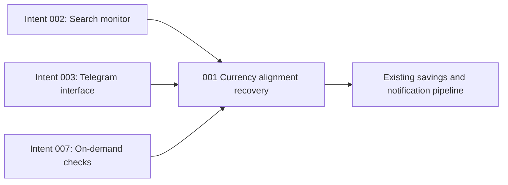

# Currency-Aligned Price Checks - Unit Decomposition

## Units Overview

This defect fix decomposes into one cohesive CLI-tool unit. Trusted URL construction, rendered-offer
selection, guarded recovery, check classification, traces, and Telegram results are one monitoring
transaction and must be regression-tested together.

### Unit 1: `001-currency-alignment-recovery`

**Description**: Request and verify the booking's baseline currency, recover one otherwise-valid
currency mismatch through deterministic and guarded-agent mechanisms, and fail closed with actionable
evidence when Booking.com will not align.

**Assigned requirements**: FR-1, FR-2, FR-3, FR-4, FR-5 (all requirements assigned exactly once).

**Stories**:

- US-057: Propagate baseline currency through trusted navigation.
- US-058: Verify rendered candidate currencies.
- US-059: Recover an otherwise-valid mismatch once.
- US-060: Report unresolved currency alignment safely.
- US-061: Preserve the shared check pipeline and safety gates.

**Deliverables**:

- Trusted baseline-currency query propagation on search and property URLs.
- Pure offer-selection evidence identifying currency-only exclusions.
- One bounded deterministic/guarded-agent recovery and re-extraction cycle.
- Currency-specific failure classification, traces, logs, and Telegram result detail.
- Focused regression tests plus full static and automated verification.

**Dependencies**:

- Depends on intent 002's search journey, offer selection, browser agent, action guard, and traces.
- Depends on intents 003 and 007 for Telegram delivery and shared check orchestration.
- No new deployable service or downstream unit is introduced.

**Estimated Complexity**: M

## Requirement-to-Unit Mapping

| Requirement | Unit | Rationale |
|-------------|------|-----------|
| FR-1 | `001-currency-alignment-recovery` | Extends trusted search/property navigation context |
| FR-2 | `001-currency-alignment-recovery` | Extends candidate eligibility evidence |
| FR-3 | `001-currency-alignment-recovery` | Coordinates bounded browser recovery and re-extraction |
| FR-4 | `001-currency-alignment-recovery` | Owns terminal check classification and diagnostics |
| FR-5 | `001-currency-alignment-recovery` | Verifies integration through the one shared monitor pipeline |

## Unit Dependency Graph

## Execution Order

1. Execute Bolt `020-currency-alignment-recovery` as one simple construction bolt.
2. Run focused monitor, URL, offer-selection, trace, and Telegram tests.
3. Run the complete suite, Ruff, and mypy before final human review.

## Independence Validation

- **Single responsibility**: Align and verify live-offer currency inside one check transaction.
- **Clear interface**: Existing `Booking`, `SearchJourney`, offer selection, `CheckResult`, trace, and
  Telegram completion seams.
- **Independent verification**: Pure URL/selection tests and mocked monitor integration cover the
  feature without requiring live Booking.com during CI.
- **Deployment boundary**: Ships in the existing daemon image with no additional process or service.

