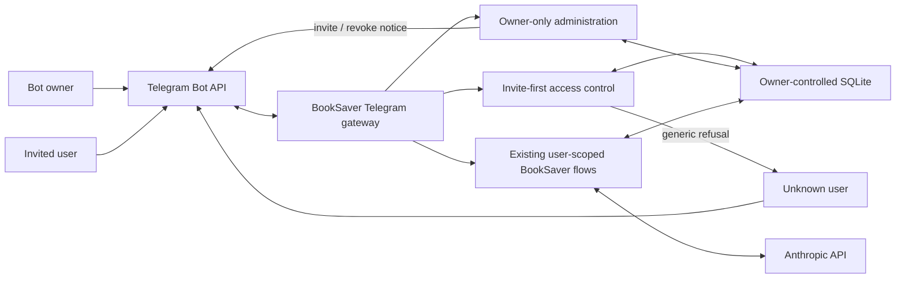

# Invite-First Sharing - System Context

## System Overview

BookSaver remains a private, owner-operated Telegram bot running inside the existing single-process
daemon. This intent makes invite redemption the only non-owner admission path, gives the owner a
copyable handoff command and recognizable user labels, and explains revocation without disclosing
whether an unknown sender has a stored account.

The stable numeric Telegram user ID remains the authorization key. An optional current username is
stored only as owner-visible display metadata after successful authorization or invite redemption.
All booking, check, savings, billing, key, and rebook boundaries remain owned by their existing
components.

## Actors

- **Bot owner** (Human): Creates and shares single-use invites, recognizes admitted users, and uses
  owner-only administration to list, revoke, or purge them.
- **Invited user** (Human): Redeems one valid invite, uses only their own BookSaver data, and receives
  an explicit access-loss message after revocation.
- **Unknown Telegram user** (Human): May discover the bot but receives only a generic private-bot
  refusal and cannot probe invite or user state.
- **Telegram gateway** (System): Parses message and callback identities, applies fixed invite-first
  access control, routes authorized commands, and rate-limits responses.
- **Local persistence** (System): Stores stable Telegram IDs, optional latest usernames, access state,
  encrypted personal keys, and single-use invite records in the owner-controlled SQLite database.

## External Systems

- **Telegram Bot API**: Supplies message/callback sender metadata and delivers invite guidance,
  redemption commands, admin confirmations, and access-loss notifications.
- **SQLite**: Persists the additive schema-v9 username field and all existing user-scoped data; it
  remains local to the owner-operated daemon.
- **Anthropic API**: Existing optional per-user/owner-billed LLM integration; this intent does not
  alter key selection, encryption, quotas, or request content.

## System Boundary and Data Flows

### Inbound

- Owner `/admin invite`, list, revoke, and purge commands plus guarded inline callbacks.
- Invited-user `/start <code>` redemption and later Telegram messages/callbacks.
- Telegram's stable numeric `from.id` and optional mutable `from.username`.
- Legacy `access_mode` configuration values, accepted only for compatible startup and ignored for
  admission behavior; invalid public/open values remain rejected.

### Outbound

- One explanatory invite message followed by one exact `/start <code>` message.
- Owner-only user lists and pickers using `@username` or an internal user-number fallback.
- Proactive and later-interaction `You no longer have access to this bot.` responses for revoked users.
- Generic rate-limited private-bot refusals for unknown users and unusable invite attempts.
- Persisted access state and optional username snapshots; usernames never enter user-facing data,
  logs, check traces, or authorization decisions.

## Context Diagram

## High-Level Constraints

- The owner role and owner-only administration remain; only the obsolete owner-only admission mode is
  removed.
- Every non-owner must be active or redeem a valid unused invite; public/open admission is forbidden.
- Numeric Telegram user ID is the sole external authorization identity.
- Username collection begins only after successful authorization/redemption and remains nullable,
  mutable, non-unique, and owner-visible only.
- Revocation commits before notification, and Telegram delivery failure cannot restore access.
- Existing user scoping, encrypted personal keys, quotas, checks, alerts, and rebook gates are unchanged.

## Key NFR Goals

- Additive, idempotent, lossless schema-v8-to-v9 migration.
- Safe startup for deployed configs containing either historical private access-mode value.
- No invite code, username, or access-state disclosure through application logs or unknown-user replies.
- Deterministic unit/integration coverage for messages, callbacks, migration, authorization, admin UX,
  notification failure, and rate limiting.
