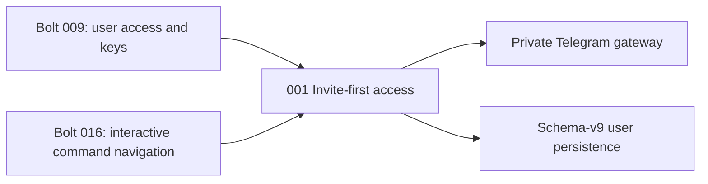

# Invite-First Sharing - Unit Decomposition

## Units Overview

This intent decomposes into one cohesive CLI-tool integration unit. Invite delivery, Telegram identity
capture, admission, revocation, and owner administration share one access boundary and must be changed
and regression-tested together.

### Unit 1: `001-invite-first-access`

**Description**: Make private bot sharing invite-first from handoff through revocation while keeping
stable-ID authorization, owner-only administration, and user-data isolation intact.

**Assigned requirements**: FR-1, FR-2, FR-3, FR-4, FR-5 (all requirements assigned exactly once).

**Stories**:

- US-062: Deliver a separate copyable invite command.
- US-063: Maintain recognizable optional Telegram usernames.
- US-064: Enforce invite-only non-owner admission.
- US-065: Explain revoked access proactively and on later interaction.
- US-066: Preserve owner administration and sharing safety.

**Deliverables**:

- Two-message invite creation for typed and inline administration.
- Telegram username propagation, schema-v9 persistence, and owner-only display labels.
- Fixed invite-first access control plus compatible legacy-config handling.
- State-aware revoked-user message/callback handling and best-effort proactive notification.
- Regression tests proving private admission, data isolation, key/billing stability, and safe failures.

**Dependencies**:

- Bolt `009-user-access-and-keys` for users, invite codes, access control, encrypted keys, and admin commands.
- Bolt `016-interactive-command-navigation` for callback routing and owner administration pickers.
- No new service, process, runtime dependency, or public access surface.

**Estimated Complexity**: M

## Requirement-to-Unit Mapping

| Requirement | Unit | Rationale |
|-------------|------|-----------|
| FR-1 | `001-invite-first-access` | Invite creation and delivery are owner-admin access operations |
| FR-2 | `001-invite-first-access` | Identity metadata enters and is displayed at the access boundary |
| FR-3 | `001-invite-first-access` | Admission policy is the unit's core invariant |
| FR-4 | `001-invite-first-access` | Revocation state and Telegram responses must remain transactional |
| FR-5 | `001-invite-first-access` | Cross-cutting safety is verified across the same sharing surface |

## Unit Dependency Graph

## Execution Order

1. Execute Bolt `021-invite-first-access` as one simple construction bolt.
2. Run focused migration, access-control, bot-loop, gateway, and admin-command tests.
3. Run full pytest, Ruff, mypy, and AI-DLC validation before the requested final review. Complete.

## Independence Validation

- **Single responsibility**: Own the complete private-sharing admission and revocation experience.
- **Clear interface**: Existing Telegram update, access-control, user repository, admin, and client seams.
- **Independent verification**: Fake Telegram transport and SQLite fixtures cover the unit without live APIs.
- **Deployment boundary**: Ships in the existing daemon image with no additional deployable component.
