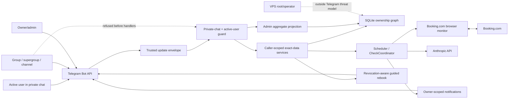

# Telegram Privacy Boundaries - System Context

## System Overview

BookSaver is a self-hosted, multi-user Telegram bot inside the existing single-process daemon. This
intent makes Telegram privacy an explicit boundary: exact booking-derived data belongs to one active
user, administration exposes only an aggregate projection, private chats are the only interactive
surface, and revocation is rechecked wherever asynchronous work can outlive the initiating update.

The boundary protects users from each other through Telegram. It does not claim to protect local data
from the owner/root operator of the VPS, who necessarily controls SQLite, traces, snapshots, process
logs, configuration, and encryption environment variables.

## Actors

- **Active invited user** (Human): Uses private-chat commands, dialogs, callbacks, immediate checks,
  alerts, and guided rebooking for that user's records only.
- **Owner/admin** (Human): Uses ordinary commands for the owner's own exact data and owner-only admin
  actions for identities, access state, and aggregate usage; ownership is never bypassed.
- **Revoked or unknown sender** (Human): Receives a non-disclosing access response and cannot reach
  stateful, expensive, or exact-data paths.
- **Telegram gateway** (System): Parses server-provided sender/chat metadata, enforces private-chat
  admission, routes commands/callbacks/dialogs, and formats scoped responses.
- **Scheduler and CheckCoordinator** (System): Serialize browser work, account per-user usage, and
  reauthorize queued or completing operations.
- **Guided rebook worker** (System): Maintains a human-confirmed session while repeatedly validating
  that the user remains active and owns the selected opportunity.
- **VPS operator** (Human): Controls the self-hosted machine and is outside the Telegram-isolation
  threat model.

## External Systems

- **Telegram Bot API**: Supplies authenticated sender ID, chat type, commands, callback queries, and
  private-message delivery over HTTPS.
- **Booking.com**: Receives read-only browser searches after a caller-owned booking has been admitted.
- **Anthropic API**: Receives bounded extraction/agent work only after active-user and ownership gates.
- **SQLite**: Stores user identity/access and exact booking-derived records; supplies separate
  caller-scoped and admin-aggregate query projections.

## System Boundary and Data Flows

### Inbound

- Telegram update metadata: sender ID, chat ID, server-provided chat type, message/callback ID, command
  family, and callback payload.
- Caller-entered booking details, confirmation IDs, edit values, key material, and confirmations.
- Admin identity selections for invite, revoke, and purge operations.
- Scheduler ticks and asynchronous completion events that may occur after access changes.

### Outbound

- Private-chat replies containing exact data only for the current active owner of that data.
- Non-enumerating responses for unknown, stale, ambiguous, foreign, and revoked selectors.
- Admin usage projections limited to identity label, access state, and approved counts.
- Savings, cap, key, immediate-check, and rebook messages delivered only after current authorization.
- Local operational traces and records retained on the owner-operated host, not exposed through admin
  Telegram commands.

## Context Diagram

## Privacy Boundary Matrix

| Surface | Exact data permitted | Authorization seam | Denial behavior |
|---------|----------------------|--------------------|-----------------|
| `/status` | No record enumeration; caller aggregates only | Private chat + active user | Generic refusal |
| Booking/check/savings commands | Caller-owned records only | Scoped query service | Missing/foreign identical |
| Edit/delete/register | Caller-owned mutation only | Scoped resolver + global-conflict masking | No mutation, no oracle |
| `/checknow` | Caller-owned request/result only | Admission and completion recheck | Unavailable without detail |
| Guided rebook | Caller-owned opportunity only | Start and every async boundary | Safe termination |
| Admin users/revoke/purge | Approved identity/access/usage fields only | Owner guard + aggregate projection | Owner-only refusal |
| Proactive notifications | Active booking owner only | Delivery-time reauthorization | Drop safely |

## High-Level Constraints

- Telegram chat type and sender identity come only from Bot API update metadata, never message text.
- Owner role grants administration, not visibility into another user's exact records.
- Unknown and foreign selectors must be indistinguishable and side-effect free.
- Privacy denial occurs before dialog/key validation, persistence mutation, browser work, or LLM work.
- Username is a mutable display label from Intent 009; immutable Telegram/internal IDs remain the
  authorization and callback targets.
- No schema migration is introduced by this intent.

## Key NFR Goals

- Zero cross-user sentinels across command, callback, dialog, completion, notification, and admin UI
  regression tests.
- Zero private-data responses or expensive/mutating operations from non-private chats.
- Zero sensitive outbound messages after delivery-time revocation is observed.
- Existing caller-owned Telegram workflows remain functional and responsive.
