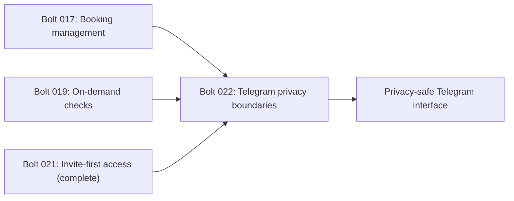

# Telegram Privacy Boundaries - Unit Decomposition

## Units Overview

This intent decomposes into one cohesive CLI/inbound-adapter unit. Private-chat admission,
caller-scoped querying, aggregate administration, asynchronous revocation, and adversarial privacy
proof are one authorization policy and must change together.

### Unit 1: `001-telegram-privacy-boundaries`

**Description**: Enforce least-privilege Telegram access across updates, repository queries, admin
projections, queued/completing work, guided rebooking, and outbound messages.

**Assigned requirements**: FR-1, FR-2, FR-3, FR-4, FR-5 (all requirements assigned exactly once).

**Stories**:

- US-067: Restrict interaction to private chats.
- US-068: Scope status and selectors.
- US-069: Show aggregate admin usage.
- US-070: Stop work after revocation.
- US-071: Prove cross-user isolation.

**Deliverables**:

- Trusted private-chat update envelope and early admission denial.
- Caller-scoped exact-data services and non-enumerating confirmation conflicts.
- Aggregate-only admin usage projection.
- Delivery/work-boundary revocation rechecks for checks, notifications, and rebook sessions.
- Cross-user/privacy matrix with focused and full-suite regression proof.

**Dependencies**:

- Depends on completed Bolt `021-invite-first-access` for username-backed identity labels and the
  invite-only sharing flow.
- Depends on completed Bolt `017-conversational-booking-management` for edit/delete selectors.
- Depends on completed Bolt `019-on-demand-check-orchestration` for shared immediate/scheduled work.

**Estimated Complexity**: L

## Requirement-to-Unit Mapping

| Requirement | Unit | Rationale |
|-------------|------|-----------|
| FR-1 | `001-telegram-privacy-boundaries` | Defines the trusted Telegram admission boundary |
| FR-2 | `001-telegram-privacy-boundaries` | Owns exact-data query and selector scoping |
| FR-3 | `001-telegram-privacy-boundaries` | Owns the distinct admin aggregate projection |
| FR-4 | `001-telegram-privacy-boundaries` | Coordinates access changes across asynchronous seams |
| FR-5 | `001-telegram-privacy-boundaries` | Proves the whole policy through one adversarial matrix |

## Unit Dependency Graph

## Execution Order

1. Complete Bolt `021-invite-first-access`. Complete.
2. Execute Bolt `022-telegram-privacy-boundaries` as one simple construction bolt. Complete.
3. Run the two-user adversarial matrix, focused concurrency/notification tests, and full quality gates. Complete.

## Independence Validation

- **Single responsibility**: One cross-cutting Telegram authorization and disclosure policy.
- **Clear interfaces**: Trusted update envelope, caller-scoped exact queries, admin aggregate query,
  and delivery-time access guard.
- **Independent verification**: Fake Bot API/coordinator/browser/LLM seams prove isolation without live
  Telegram, Booking.com, or Anthropic calls.
- **Deployment boundary**: Ships in the existing daemon image with no new process or datastore.
