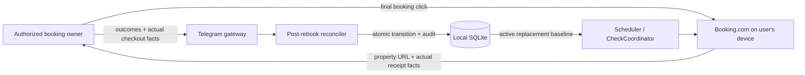

# Post-Rebook Monitoring - System Context

## System Overview

The existing Telegram rebook worker hands destructive actions to the user's device and records
reported outcomes. This intent adds a post-handoff reconciliation boundary that accepts actual final
reservation facts, atomically changes the caller-owned monitored aggregate when safe, and leaves the
scheduler/check pipeline to consume the updated row normally.

## Actors

- **Authorized booking owner**: Reports cancellation/booking outcomes and supplies actual replacement facts.
- **Telegram bot gateway**: Delivers private prompts, callbacks, text-dialog answers, and final status.
- **Post-rebook reconciler**: Validates the outcome matrix and requests an atomic persistence transition.
- **Scheduler/CheckCoordinator**: Reads active bookings after reconciliation; unchanged by this intent.
- **VPS owner/operator**: Hosts local persistence but gains no Telegram ownership override.

## External Systems

- **Telegram Bot API**: Inbound private answers and outbound acknowledgements/final messages.
- **Booking.com**: User-controlled device checkout and source of the pasted same-property URL; no new automated action.
- **SQLite**: Atomic booking/savings/audit reconciliation.

## Data Flows

### Inbound

- User-reported cancellation outcome: completed, abandoned, or unreported.
- User-reported replacement outcome: completed, abandoned, or unreported.
- Actual replacement confirmation ID, canonical Booking.com property URL, and all-in Money.
- Final explicit confirmation of the collected facts.

### Outbound

- Per-answer acknowledgements and validation re-prompts.
- Final disposition: replacement monitored, original monitored, or no booking monitored.
- Existing scheduler reads of the updated/archived booking.

## Context Diagram

## High-Level Constraints

- Device-side final click remains mandatory; no new browser action is introduced.
- The caller's numeric Telegram identity, active access, and booking ownership are revalidated.
- No detected price becomes a paid baseline without user-supplied actual facts.
- Stable booking identity preserves relational history.

## Key NFR Goals

- Transactional consistency across booking, savings invalidation, and audit append.
- Fail closed on stale snapshots, revocation, ownership mismatch, and conflicting confirmation.
- Clear recovery guidance for every partial outcome.
