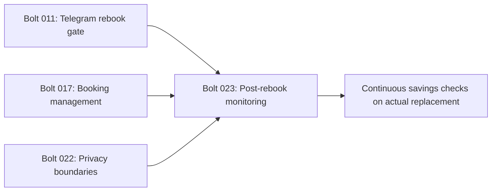

# Post-Rebook Monitoring - Unit Decomposition

## Units Overview

This intent is one cohesive domain-heavy CLI/Telegram unit. Outcome reconciliation, actual-fact
collection, atomic monitoring propagation, stale-savings invalidation, and audit/authorization
guards share one consistency boundary and must ship together.

### Unit 1: `001-post-rebook-monitoring`

**Description**: Reconcile device-side rebook outcomes and continue monitoring from the actual replacement reservation when safe.

**Assigned requirements**: FR-1, FR-2, FR-3, FR-4, FR-5 (each assigned exactly once).

**Stories**:

- US-072: Collect actual replacement facts.
- US-073: Propagate the monitored replacement atomically.
- US-074: Reconcile partial outcomes safely.
- US-075: Preserve audit and invalidate stale savings.
- US-076: Preserve ownership, revocation, and visible completion.

**Deliverables**:

- Validated Telegram replacement-facts dialog with answer acknowledgements.
- Explicit rebook outcome matrix and disposition messages.
- Atomic SQLite replacement/archive operations over the stable booking aggregate.
- Retained history, invalidated stale savings, and additive audit events.
- Focused and full regression proof.

**Dependencies**:

- Bolt 011 Telegram rebook gate and ADR-012 device handoff.
- Bolt 017 booking update/invalidation patterns.
- Bolt 022 ownership/private-chat/revocation boundaries.

**Estimated Complexity**: L

## Requirement-to-Unit Mapping

| Requirement | Unit | Rationale |
|-------------|------|-----------|
| FR-1 | `001-post-rebook-monitoring` | Owns actual replacement fact collection |
| FR-2 | `001-post-rebook-monitoring` | Owns the atomic monitored-aggregate transition |
| FR-3 | `001-post-rebook-monitoring` | Owns the outcome state matrix |
| FR-4 | `001-post-rebook-monitoring` | Owns savings invalidation and audit retention |
| FR-5 | `001-post-rebook-monitoring` | Owns access/ownership/final UX guards |

## Unit Dependency Graph

## Execution Order

1. Model the outcome and propagation invariants.
2. Design the dialog/application/repository transaction boundary.
3. Implement Bolt `023-post-rebook-monitoring`.
4. Verify every outcome combination, access race, persistence invariant, and full regression suite.
