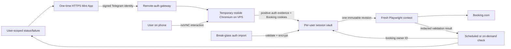

# System Context: Per-User Booking.com Sessions

## Actors

- **Telegram user**: Owns bookings and one Booking.com account/session.
- **VPS operator**: Admits users, configures HTTPS, and retains CLI import only for recovery.
- **Scheduler / `/checknow`**: Requests an authenticated session for the booking owner.
- **Remote-login user**: Controls a temporary VPS browser from their phone and completes Booking.com login/MFA personally.

## External Systems

- **Booking.com mobile website**: Receives restored authenticated browser state and returns account-eligible prices.
- **Telegram Mini App**: Supplies signed Telegram identity to the HTTPS gateway and displays the remote browser canvas.
- **Caddy**: Terminates public HTTPS/WSS and proxies only to internal gateway/websockify listeners.
- **Playwright + Xvfb + x11vnc + noVNC/websockify**: Runs and streams one transient headed mobile browser.
- **Telegram Bot API**: Starts `/connect` and displays redacted health/outcomes; never carries session payloads or credentials.

## Boundary and Data Flows

- Primary inbound: `/connect` → one-time attempt → Telegram-signed identity → remote interaction with real Booking.com page.
- Recovery inbound: local cookie JSON + explicit Telegram ID → validate/normalize/encrypt/atomically persist.
- Capture: positive rendered authentication → normalized Booking.com cookies → encrypted per-user revision → transient teardown.
- Runtime: booking owner ID → resolve/decrypt immutable session revision → isolated Playwright context.
- Outbound: refreshed browser state → compare-and-replace encrypted bundle; redacted health/status.
- Failure: typed per-user authentication failure → check history/Telegram guidance; no price/savings.

## Trust Boundaries

- Cookie exports and decrypted browser state are password-equivalent secrets.
- Telegram identity is authorization input, not secret transport.
- Browser context and session revision form the cross-user isolation boundary.
- HTTPS protects phone-to-VPS transit; the owner-operated VPS remains a trusted endpoint and root compromise can observe browser input.
- The public Caddy boundary never exposes Python/VNC listener ports directly.
