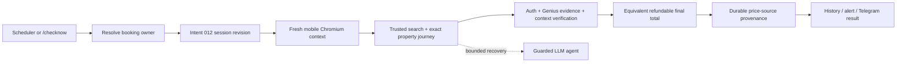

# System Context: Authenticated Mobile-Web Monitoring

## Actors and Systems

- **Telegram user**: Owns the booking/session and receives provenance-labeled outcomes.
- **Check coordinator**: Serializes scheduled and on-demand work.
- **Per-user session provider**: Supplies exactly one authenticated owner revision.
- **Playwright Chromium**: Emulates the configured mobile-web device.
- **Booking.com mobile website**: Renders authenticated/account/mobile-eligible offers.
- **LLM browser/extraction adapters**: Recover or interpret ambiguous mobile layouts within existing guards.

## Trust Boundary

The session revision is opaque outside Intent 012. Mobile monitoring may restore state and report a
revision identifier/validation result but cannot persist or log raw browser state.
