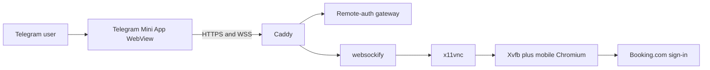

# Remote Authentication Display Reliability - System Context

## System Overview

Telegram opens a signed Mini App served by the BookSaver remote-auth gateway. After Telegram
identity exchange, the page loads noVNC and streams one temporary Android-emulated Chromium display
through Caddy, websockify, and x11vnc. This fix changes only the browser viewer policy and feedback.

## Context Diagram

## External Integrations

- **Telegram Mini Apps**: Supplies signed `initData` and hosts the viewer WebView.
- **Booking.com**: Supplies the mobile-web authentication page inside server-side Chromium.
- **Caddy**: Terminates HTTPS and proxies same-origin HTTP/WebSocket traffic.
- **noVNC stack**: Translates x11vnc framebuffer updates into an HTML canvas.

## High-Level Constraints

- Capability-bearing URLs and tokens must not be logged or displayed.
- Raw gateway, VNC, and WebSocket services remain private to the Compose network.
- The CSP remains deny-by-default and adds no arbitrary outbound image access.

## Key NFR Goals

- Render compressed framebuffer updates consistently across Telegram mobile and desktop WebViews.
- Surface safe viewer failures without weakening identity, origin, or lifecycle controls.
