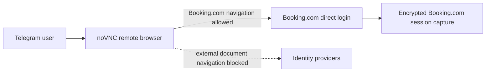

# Authentication Boundary Hardening - System Context

## System Overview

This intent closes two authentication-boundary gaps in the self-hosted Telegram service: the owner
must be able to remove all retained state for a non-owner user, and a user operating the transient
remote browser must remain on Booking.com rather than entering credentials into an unsupported
external identity provider.

## Actors

- **BookSaver owner**: explicitly confirms destructive removal of an admitted non-owner.
- **Admitted Telegram user**: directly authenticates their own Booking.com account in `/connect`.
- **Telegram Mini App/noVNC viewer**: displays the transient VPS browser without receiving passwords.
- **Remote-auth manager**: serializes browser attempt state, cancellation, and cookie capture.
- **Encrypted session repository**: stores one Fernet-encrypted Booking.com cookie bundle per local
  user and a non-secret permanent revocation marker for purged local user IDs.
- **SQLite user repository**: stores user identity, access, bookings, checks, savings, and audit
  state.

## External Systems

- **Booking.com**: the only permitted top-level authentication origin.
- **External identity providers**: Google, Apple, Microsoft, Facebook, and future providers are
  explicitly outside the interactive browser boundary.
- **Telegram**: delivers owner confirmation controls, `/connect`, and safe guidance.

## Data Flows

### Confirmed purge

```mermaid
sequenceDiagram
    participant O as BookSaver owner
    participant A as Admin handler
    participant R as Remote-auth manager
    participant S as Encrypted session store
    participant D as SQLite
    O->>A: Confirm purge target
    A->>R: Cancel target login attempt
    A->>S: Revoke target and delete session
    alt session deletion succeeds or was absent
        A->>D: Delete target-owned database state
        A-->>O: Purge completed
    else session deletion fails
        A-->>O: Purge failed; database retained
    end
```

### Direct remote login



## High-Level Constraints

- The owner can never be purged.
- Session capture and purge cancellation must use the same manager synchronization boundary.
- Booking.com hostname matching must reject suffix-spoofed domains.
- External non-navigation subresources remain available when needed by Booking.com; interactive
  page and child-frame navigation is constrained.
- No passwords, cookies, capability URLs, or identity-provider error details enter Telegram or logs.

## Key NFR Goals

- No successful purge leaves a target session or permits an in-flight login to restore it.
- No external identity-provider document loads in the transient remote browser.
- Direct Booking.com login and existing cleanup/timeout behavior remain operational.
