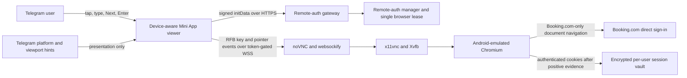

# Device-Aware Remote Authentication Viewer - System Context

## System Overview

A Telegram user opens BookSaver's signed Mini App and controls a temporary Android-emulated
Booking.com login browser running on the trusted VPS. The Mini App currently displays that browser
as a noVNC canvas, so a phone treats remote text fields as pixels and does not open its native
keyboard. This intent adds a device-aware local input layer around the existing canvas while
preserving the authenticated viewer, remote-browser, and encrypted-session boundaries.

## Actors

- **Touch-only Telegram user**: signs in directly to Booking.com using a phone or tablet software
  keyboard.
- **Desktop Telegram user**: continues using a physical keyboard and mouse, with an optional input
  fallback.
- **Telegram Mini App WebView**: supplies signed identity data, platform hints, viewport values, and
  the local user-gesture environment needed to open a native keyboard.
- **BookSaver remote-auth gateway**: serves the viewer and authorization/session state without
  accepting credentials.
- **Remote-auth manager**: owns the single browser lease, attempt ownership, cancellation, and
  same-user abandoned-attempt recovery.
- **noVNC RFB client**: renders the remote framebuffer and forwards bounded keyboard/pointer events.
- **Transient mobile Chromium session**: renders Booking.com under the configured Android context
  and yields cookies only after positive account evidence.

## Context Diagram

## External Integrations

- **Telegram Mini Apps**: hosts the viewer and exposes platform/viewport presentation signals.
- **Booking.com**: supplies the direct mobile-web sign-in flow inside remote Chromium.
- **noVNC 1.6 stack**: supplies RFB rendering plus keyboard/keysym modules used by the input bridge.
- **Caddy/websockify/x11vnc/Xvfb**: preserve the existing HTTPS-to-private-display transport.

## Data Flows

### Inbound

- Signed Telegram `initData` enters the existing authorization exchange.
- Untrusted client platform, pointer, touch, viewport, and safe-area signals affect layout only.
- Native keyboard input enters a local hidden input after an explicit user gesture.

### Outbound

- The hidden input is translated directly into RFB key events over the existing token-gated WSS.
- No credential text is sent to a BookSaver HTTP endpoint, Telegram message, clipboard, log, or
  persistence layer.
- Terminal status and safe retry guidance are rendered in the Mini App.
- Viewer close performs best-effort cancellation, and only the same Telegram user may immediately
  replace their own current nonterminal attempt.

## High-Level Constraints

- The server-side browser profile remains fixed and Android-emulated for consistent mobile-web
  behavior.
- The viewer cannot inspect remote Booking.com DOM semantics and cannot automatically identify
  remote text fields.
- CSP, same-origin, session capability, browser lease, navigation, cleanup, and encryption
  boundaries remain unchanged.
- Generic noVNC settings, clipboard, file transfer, and full control-panel surfaces remain hidden.
- The remote Chromium surface may hide desktop tabs/address chrome, but it remains Linux Chromium
  under Xvfb rather than a native mobile browser.

## Key NFR Goals

- Real Android and iOS software keyboards work without physical hardware.
- The viewer remains stable across keyboard-driven viewport changes and safe-area insets.
- Desktop input and all remote-auth security/lifecycle behavior remain regression-free.
- Credential text has no new durable or observable path.
