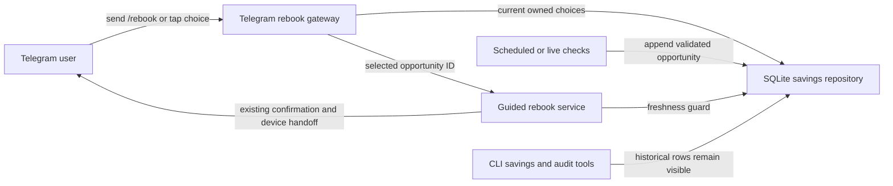

# Current Rebook Opportunities - System Context

## System Overview

Each successful savings check is retained as a historical opportunity. Telegram currently converts
all owned historical rows into `/rebook` buttons, so repeated checks for the same reservation create
duplicate and contradictory actions. This intent adds an explicit current-action selection policy
between persistence and the existing guided-rebook service.

## Actors

- **Telegram user**: chooses the newest known opportunity for one of their active bookings.
- **Telegram command gateway**: renders the current picker and revalidates button freshness.
- **Rebook application service**: performs the final freshness guard before creating a guided
  session.
- **SQLite savings repository**: retains history and returns one current row per active owned
  booking.
- **BookSaver scheduler/check-now flow**: continues appending validated opportunities.
- **Booking.com**: remains outside this selection operation; no request is made by `/rebook`.

## Context Diagram

## Data Flows

### Inbound

- User identity and optional opportunity ID enter through the existing Telegram command/callback.
- New validated savings opportunities continue to enter through the existing savings pipeline.

### Outbound

- The picker receives at most one current opportunity per active owned booking.
- Superseded selections return safe guidance and produce no session or confirmation prompt.
- Historical rows remain available to existing audit and CLI readers.

## Boundaries

- No live Booking.com request occurs while listing or starting a rebook.
- Ownership, active booking status, callback privacy, session concurrency, and human final-action
  gates remain authoritative.
- Persistence history is retained; only actionability is collapsed.
