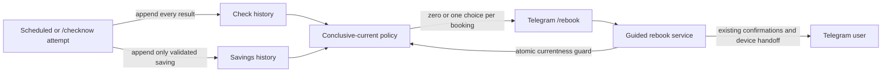

# Conclusive Rebook Opportunity Lifecycle - System Context

## System Overview

Intent 017 selected the newest positive savings row per booking. This refinement also considers
later check history: technical failures preserve the last conclusive positive row, while a later
successful or `NO_EQUIVALENT_OFFER` check supersedes the prior market state.

## Actors

- **Telegram user**: sees and selects the latest conclusive savings state for each owned booking.
- **Check coordinator and savings pipeline**: append check history, then append a positive
  opportunity when a successful result is cheaper than the paid baseline.
- **SQLite repositories**: derive current actionability without mutating history.
- **Guided rebook service**: repeats the lifecycle guard before human confirmations.
- **Operator diagnostics**: continue reading complete historical checks and opportunities.

## Context Diagram

## Data Flows

### Inbound

- Persisted successful and failed check results with stable `check_id` linkage.
- Positive savings opportunities tied to their originating check.
- User-scoped `/rebook` commands and callbacks.

### Outbound

- One current positive choice when the latest conclusive check produced savings.
- No choice when the latest conclusive check produced no saving or no equivalent availability.
- The previous choice when only later non-conclusive technical attempts failed.

## Boundaries

- Classification uses existing persisted outcome and failure-code fields.
- Historical records are not mutated or deleted.
- Ownership, active status, atomic session creation, and human final actions remain unchanged.
