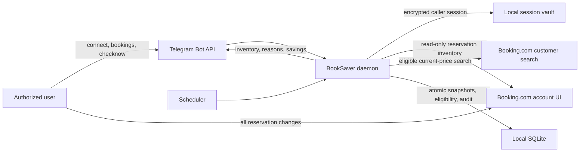

# Booking Account Synchronization - System Context

## System Overview

BookSaver uses each active user's encrypted Booking.com session to synchronize that user's complete
hotel-reservation inventory. Booking.com is authoritative for reservation facts and lifecycle;
BookSaver persists read-only snapshots for eligibility, monitoring, current savings, and audit.

## Actors

- **Authorized user**: Authenticates with Booking.com, views synchronized reservations, and requests
  price checks. All booking and cancellation actions happen independently in Booking.com.
- **BookSaver scheduler**: Synchronizes each user before planning scheduled checks.
- **BookSaver Telegram adapter**: Triggers `/connect`, `/bookings`, and `/checknow` and renders
  caller-scoped results.
- **Booking.com authenticated web UI**: External source of reservation identity, booked facts, and
  lifecycle state.
- **Booking.com customer search**: Separate external source of current bookable candidate prices.
- **Local SQLite and encrypted session vault**: Store caller-scoped snapshots, audit, checks,
  savings, identities, and encrypted browser state.

## Data Flows

1. `/connect` or another session-intake path commits encrypted authenticated state.
2. A trigger acquires the existing browser coordinator and opens a clean caller-owned context.
3. The inventory adapter traverses the supported Booking.com reservation UI and returns observed
   reservations plus explicit complete/incomplete/failed evidence.
4. The reconciliation service validates remote identities and facts, atomically replaces the
   caller's synchronized snapshot set, derives eligibility reasons, and invalidates stale current
   savings.
5. `/bookings` renders only synchronized future upcoming reservations and their eligibility;
   scheduled or on-demand monitoring sends only eligible snapshots through the existing
   customer-search price journey. Historical and non-upcoming snapshots remain internal.

## Context Diagram

## Trust and Action Boundaries

- Booking.com content, remote identifiers, callbacks, and model output are untrusted inputs.
- Only a conclusive complete traversal authorizes absence-based reconciliation.
- Inventory automation cannot cancel, modify, reserve, purchase, pay, or enter account settings.
- Reservation-management prices are booked baselines only; candidate prices come from customer
  search.
- No similar-reservation or replacement relationship is inferred.
- Every read and write is scoped to the active user resolved from numeric Telegram identity.

## Key NFR Goals

- Idempotent and atomic per-user reconciliation.
- Zero cross-user disclosure or fallback.
- One bounded inventory traversal per user per trigger batch.
- Immediate command acknowledgement and visible recovery for stale/auth-required state.
- Recoverable database backup before destructive legacy-booking cutover.
