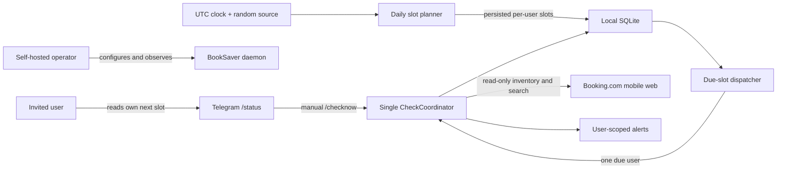

# Randomized Daily Booking Checks - System Context

## System Overview

BookSaver plans durable random daily check slots for each active user, dispatches only due users
through the existing single check coordinator, synchronizes that user's authenticated Booking.com
inventory once, and runs the ordinary price-check pipeline for every currently eligible booking.

The schedule uses UTC and persists locally in SQLite. Telegram users see only their own next slot.
Operators can observe redacted slot lifecycle evidence. Booking.com, Telegram, encrypted sessions,
and reservation safety boundaries remain unchanged.

## Actors

- **Invited BookSaver user** (Human): Owns synchronized reservations and receives three broadly
  distributed scheduled opportunities per continuously eligible booking and available UTC day.
- **BookSaver operator** (Human): Configures the self-hosted daemon and diagnoses planned,
  completed, or missed slots through local logs and aggregate status.
- **Randomized schedule planner** (System): Generates and persists constrained random UTC slots per
  active user and date.
- **Scheduler dispatcher** (System): Claims due slots, enforces grace/spacing, and requests one
  user-scoped scheduled batch.
- **CheckCoordinator** (System): Retains sole ownership of scheduled/manual admission, authenticated
  synchronization, quota reservation, browser work, history, savings, and notification routing.

## External Integrations

- **Booking.com authenticated mobile web**: Read-only account synchronization and verified live
  customer-search pricing through the booking owner's encrypted session.
- **Telegram Bot API**: Caller-scoped `/status`, existing `/checknow`, and ordinary alerts.
- **Local SQLite**: Authoritative durable slot plan and lifecycle alongside existing synchronized
  reservation and monitoring state.
- **Host process manager**: Restarts the foreground daemon; durable slots prevent reroll or duplicate
  dispatch after restart.

## Data Flows

### Inbound

- Active-user identity and synchronized eligible-booking projection from SQLite.
- UTC clock, injected random source, and validated schedule configuration.
- Manual `/checknow` requests that may temporarily own the shared coordinator gate.
- Stop requests from the daemon lifecycle.

### Outbound

- Persisted planned/running/completed/missed slot records.
- One user-scoped scheduled-batch request for a claimable due slot.
- Existing booking check history, traces, savings, alerts, and session-recovery notifications.
- Caller-scoped next-slot status and redacted operational logs.

## Context Diagram

## High-Level Constraints

- UTC is the only schedule timezone in this intent.
- The default has three windows and a two-hour minimum spacing, including across date boundaries.
- One coordinator and one browser gate remain authoritative; no overlapping Playwright work.
- A one-hour grace permits at most one catch-up and never a burst of missed checks.
- Schedule metadata remains local and caller-scoped.
- BookSaver never reserves, cancels, purchases, pays, or submits a final booking action.

## Key NFR Goals

- Restart-safe, idempotent slot generation and atomic duplicate suppression.
- Interruptible idle waiting and indexed bounded persistence.
- Random distribution inside broad windows with invariant-based tests.
- No regressions to authenticated inventory freshness, quotas, privacy, or shutdown.
