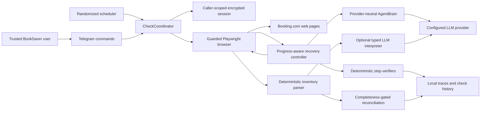

# Booking Browser LLM Recovery - System Context

## System Overview

BookSaver runs deterministic, caller-scoped Booking.com browser journeys inside one serialized
coordinator. This intent introduces one progress-aware recovery boundary shared by customer-search
monitoring and authenticated account inventory. The browser supplies bounded observations and
structured outcomes; the configured LLM proposes only guarded read-only actions or typed inventory
interpretation; deterministic verifiers and reconciliation rules decide whether work succeeded.

## Actors

- **BookSaver user**: Requests `/bookings` or `/checknow` and expects fresh caller-owned evidence.
- **Self-hosted operator**: Configures LLM access, budgets, diagnostics, and deployment.
- **Scheduler**: Triggers caller-scoped inventory synchronization and price checks.
- **CheckCoordinator**: Owns the single browser gate, caller authorization, daily accounting, and
  lifecycle cleanup.
- **LLM provider**: Receives bounded page evidence and returns untrusted tool calls or typed
  interpretation through the configured adapter.
- **Booking.com**: Supplies authenticated reservation inventory and customer-search pages whose DOM
  may change independently.

## Context Diagram

## External Integrations

- **Booking.com**: Outbound HTTPS through synchronous Playwright; pages are untrusted dynamic input.
- **Anthropic**: Current outbound LLM provider for agent actions and typed fallback interpretation.
- **Future providers**: Out of scope here, but must be able to implement the same neutral contracts.
- **Telegram Bot API**: Caller-scoped status and refresh outcomes; no model internals or sensitive
  reservation identity is disclosed.

## Data Flows

### Inbound

- Current browser URL/title, bounded visible text, safe interactive element metadata, screenshot,
  and top-level page-count metadata.
- Scripted-step exception category and deterministic verification result.
- LLM tool selection or typed inventory candidate, treated as untrusted input.

### Outbound

- Guarded `click`, `fill`, `select`, and `scroll` actions addressed only by fresh element refs.
- Bounded redacted prompt evidence to the caller-selected provider.
- Structured recovery outcomes, synchronization audit, and user-visible freshness guidance.

## Trust and Authority Boundaries

- ActionGuard and URL allowlists are code-enforced after model output and across all top-level pages.
- The model cannot create tools, selectors, URLs, reservation identity, or completeness authority.
- A model-assisted observation may contribute positive evidence only after strict typed validation.
- Only deterministic traversal evidence can establish complete inventory and authorize absence-based
  reconciliation.
- Authentication, credentials, MFA, and human-controlled browser work never enter recovery.

## High-Level Constraints

- One process, one coordinator/browser gate, synchronous Playwright, no agent framework.
- Deterministic-first behavior adds zero LLM calls on healthy pages.
- Per-user session/key/usage isolation and current hard budgets remain authoritative.
- Existing price-source, refundability, equivalence, and human-only action boundaries do not change.

## Key NFR Goals

- Unreachable recovery ends within four LLM calls and 60 seconds.
- Zero prohibited action executions.
- No model-assisted incomplete run makes unseen reservations absent.
- Offline deterministic tests cover all controller, safety, and reconciliation invariants.
