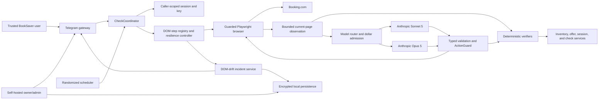

# Adaptive Booking Browser Resilience - System Context

## System Overview

BookSaver runs deterministic, caller-scoped Booking.com account synchronization and customer-search
price checks through one serialized browser coordinator. This intent adds an exhaustive DOM-step
registry, adaptive Sonnet-to-Opus recovery, typed page interpretation, reasoned terminal outcomes,
deployment-wide dollar admission, and owner-only DOM-drift incidents.

The LLM may observe and classify a current Booking.com page when deterministic evidence is
ambiguous. Predictable failures terminate immediately under their exact code without an LLM call.
When invoked, the model may act only through the existing guarded read-only action vocabulary on
approved destinations. Protected authentication and transaction states are observation-only.
Code-owned verifiers and domain policies remain the sole authority for success and state mutation.

## Actors

- **Trusted BookSaver user** (Human): Invokes `/connect`, `/bookings`, and `/checknow` and receives
  caller-scoped recovery or reconnect guidance.
- **Self-hosted owner/admin** (Human): Configures the approved models and budgets, receives
  content-free maintenance incidents, and inspects encrypted local evidence.
- **Scheduler** (System): Starts persisted randomized synchronization and price-check work for the
  correct local user.
- **CheckCoordinator** (System): Owns browser admission, caller authorization, session/key resolution,
  job budgets, cleanup, and use of the shared resilience boundary.
- **Deterministic verifiers** (System): Decide page postconditions, authentication state changes,
  inventory completeness, identity, offer equivalence, and accepted price evidence.
- **Sonnet 5** (External model): Default bounded page classifier, recovery agent, typed interpreter,
  and first-line diagnostic.
- **Opus 5** (External model): Bounded escalation after measured Sonnet quality failure and final
  code-maintenance diagnosis.
- **Booking.com** (External system): Supplies authenticated account and customer-search pages whose
  DOM, visible copy, controls, and navigation behavior may change independently.
- **Telegram Bot API** (External system): Delivers caller-safe outcomes and owner-only content-free
  incident notifications.
- **Local encrypted persistence** (System): Stores sessions, budgets, audits, incident correlation,
  and seven-day diagnostic bundles under owner control.

## External Systems

- **Booking.com**: Outbound HTTPS through synchronous Playwright; all rendered page content is
  untrusted dynamic input.
- **Anthropic API**: Outbound typed prompts, screenshots, tool results, and usage metadata for the
  configured Sonnet 5 and Opus 5 profiles.
- **Telegram Bot API**: Outbound user guidance and owner incident notifications; inbound trusted-user
  commands continue through the existing Telegram gateway.
- **VPS filesystem and SQLite**: Owner-controlled local storage for encrypted diagnostic evidence,
  restart-safe daily spend, and content-free audit state.

## Data Flows

### Inbound

- Current browser destination category, title, bounded visible text, sanitized structural elements,
  screenshot, popup/page count, and deterministic verification outcome.
- Caller command or scheduled trigger plus caller-scoped booking/session context.
- Sonnet/Opus typed classifications, guarded action proposals, typed positive observations, and
  usage metadata; all are untrusted until validated.
- Telegram delivery success/failure and local clock values for budget, deduplication, and retention.

### Outbound

- Guarded `click`, `fill`, `select`, and `scroll` actions addressed only by fresh observed element
  references on allowlisted read-only destinations.
- Bounded evidence and structured outcome history to the caller-authorized Anthropic key.
- Code-validated reservation observations, offer candidates, page-state transitions, and explicit
  terminal reason provenance to existing application services.
- Caller-safe retry/reconnect guidance and owner-only content-free incident notification.
- Encrypted seven-day diagnostic bundle plus redacted recovery, model, budget, and incident audit.

## Context Diagram

## Trust and Authority Boundaries

- Browser content and provider output are untrusted; prompt text cannot expand tools, destinations,
  permissions, budgets, or domain authority.
- Authentication/MFA/captcha/bot-wall pages may be observed and classified but never operated by a
  model. Credentials and session secrets never enter prompts or diagnostic bundles.
- ActionGuard and Booking.com allowlists validate every proposed action after model output and every
  resulting top-level page before progress is accepted.
- Deterministic verifiers alone establish authenticated state, inventory completeness, reservation
  identity, equivalent refundable offers, currency-aligned totals, and reconciliation eligibility.
- Caller data remains caller-scoped. Owner incidents intentionally omit caller identity and page
  content; the encrypted bundle stays local and owner-controlled.
- The USD 1 job and USD 10 deployment-day ceilings are code-enforced admission boundaries, not model
  instructions.

## High-Level Constraints

- One process, one `CheckCoordinator` browser gate, synchronous Playwright, no agent framework.
- Sonnet 5 primary and Opus 5 escalation only; Fable and cross-provider routing are excluded.
- Healthy deterministic execution makes zero LLM calls.
- Final reservation action always remains with the user in Booking.com.
- Existing per-user session/key/call/check isolation and limits remain additive and authoritative.

## Key NFR Goals

- Every registered DOM-sensitive step has a specific deterministic terminal mapping and an LLM
  fallback wherever ambiguity can remain.
- No registered DOM failure silently becomes success, empty inventory, or generic unknown failure.
- Zero protected or transactional action executions.
- Provider spend never starts a call whose conservative estimate exceeds USD 1/job or USD 10/day.
- Owner notification contains no user/account/page content; encrypted bundles expire after seven days.
