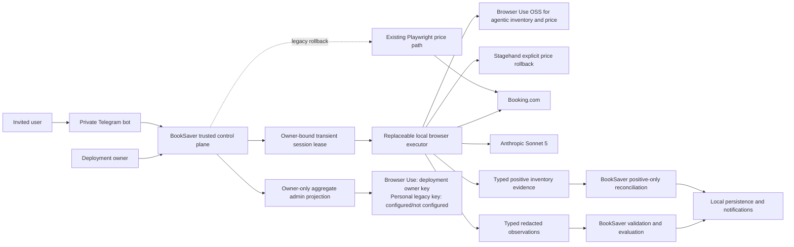

# System Context: Replaceable Agentic Browser Executor

## Actors

- **Deployment owner** (Human): Self-hosts BookSaver, configures the Anthropic key, owns operational
  cost and privacy policy, runs the live canary, and controls promotion/rollback.
- **Invited user** (Human): Uses the private Telegram bot, supplies a Booking session through
  `/connect`, and may consent to owner-funded Browser Use checks across inventory and price work.
- **BookSaver scheduler/coordinator** (System): Authorizes and serializes checks under the global
  browser lease and daily limits.
- **BookSaver validation/evaluation** (System): Independently validates untrusted observations,
  selects equivalent refundable all-in offers, persists results, and permits notifications.
- **Local browser executor** (System): Performs bounded perception and read-only navigation in a
  transient browser without domain authority. Browser Use handles every inventory trigger and is
  the default executor for both manual and scheduled price checks; Stagehand remains an explicit
  price rollback.
- **Inventory reconciliation policy** (System): Accepts only validated positive reservation
  observations, derives eligibility, and prevents agentic evidence from marking unseen rows absent.
- **Owner administration projection** (System): Shows identity, aggregate usage, Browser Use funding
  policy, and coarse personal legacy-key presence without decrypting keys or loading exact records.

## External Systems

- **Booking.com**: Authenticated mobile-web pricing and account content over HTTPS; dynamic,
  unversioned presentation surface.
- **Anthropic API**: Sonnet 5 semantic and computer-use inference using the deployment owner's key;
  receives bounded visible page evidence but never session cookies or credentials.
- **Telegram**: Existing invite-only user interaction, `/connect` disclosure, and notifications.
- **Loopback services**: In-process Stagehand and Browser Use runners and any local telemetry sink;
  no content export.

## Trust Boundaries

1. BookSaver domain inputs, authorization, session ownership, and budgets are trusted code-owned
   inputs.
2. Decrypted cookies exist only inside a transient local browser boundary. The transient executor
   reuses the configured version-matched mobile identity that produced and verified the session;
   browser identity is part of session compatibility, not model input.
3. Stagehand actions, Browser Use actions, extraction, and Anthropic outputs are untrusted
   proposals/evidence.
4. The code guard owns every browser mutation and rejects unsafe requests before and after action.
5. Only BookSaver validation/evaluation can create a valid candidate, savings opportunity, or
   notification.

## Data Flows

### Inbound

- Trusted booking property reference, dates, occupancy, expected currency, owner/session binding,
  deadline, action limit, and cost reservation.
- Trusted inventory scopes, authorized account binding, and current-run execution identity.
- Stagehand semantic action proposals and typed extraction.
- Browser Use guarded read-only proposals and typed inventory or price submissions.
- Anthropic computer-use action requests, typed observation submissions, terminal outcomes, and
  usage data.
- Booking.com rendered visible content and server-verified authentication state.

### Outbound

- Guarded read-only browser actions to Booking.com.
- Bounded semantic evidence and escalation screenshots to Anthropic.
- Typed, redacted price observations to BookSaver validation.
- Typed positive reservation observations and traversal coverage to BookSaver inventory validation.
- Redacted metrics/failure codes to local persistence and owner-only operations.
- Owner-only aggregate funding provenance and configured/not-configured personal legacy-key state to
  Telegram administration.
- Existing savings notifications after independent validation.

### Forbidden Flows

- Cookies, credentials, MFA values, clipboard, files, model reasoning, or full page evidence to
  results/logs/persistence.
- API key plaintext, ciphertext, prefix, suffix, hash, fingerprint, or validation details to any
  admin projection, log, trace, or Telegram response.
- Model-selected arbitrary URLs or unguarded browser actions.
- Executor decisions about equivalence, savings, transaction authority, or user identity.
- Executor decisions that inventory is authoritatively complete or that an unseen reservation is
  absent.

## System Context Diagram

## Lifecycle

1. Coordinator authorizes the user and booking, verifies current invitee disclosure where required,
   reserves budget, and selects routing mode.
2. Session service decrypts verified cookies into a fresh local browser owned by a scoped lease.
3. The executor first reaches the requested protected Booking.com capability with the matching
   mobile identity. A code-owned preflight rejects unusable model views and sanitized transport,
   authentication, or challenge failures before paid inference whenever detectable.
4. Browser Use receives only task-specific guarded actions and typed terminal submissions; every
   physical action and resulting destination remains code-authorized.
5. Stagehand remains selectable for future jobs as an explicit rollback but never runs after a
   failed Browser Use operation in the same job.
6. Executor returns typed evidence without domain conclusions or secret material.
7. BookSaver validates facts, evaluates equivalence/savings, reconciles cost, optionally persists
   verified refreshed cookies, records redacted metrics, and destroys the browser profile.

## Price Lifecycle

1. `/checknow` and scheduled work resolve through the same price-executor factory and
   `PriceBrowserExecutor` application service.
2. Owner-canary routes select Browser Use for the owner. The explicit `consented_users` route selects
   Browser Use for the owner and every currently disclosed active invitee without claiming the
   statistical qualification gate passed; qualification-gated `agentic` remains available.
3. The local Browser Use agent navigates and perceives through guarded human-like actions, then
   submits typed query facts and offers or one closed terminal outcome.
4. BookSaver independently verifies property, dates, occupancy, authentication, currency, all-in
   status, explicit refundability, room equivalence, and savings.
5. An operator-only production replay can execute this exact path against isolated state, wait for
   terminal completion, and suppress notifications and authoritative booking mutations.

## Inventory Lifecycle

1. A disclosed authorized user triggers `/bookings`, post-connect synchronization, `/checknow`, or a
   scheduled slot under the single coordinator gate. Every agentic inventory trigger selects the
   same Browser Use adapter.
2. BookSaver issues an account-bound session lease and fixed upcoming, past, and cancelled work
   scopes to the inventory executor.
3. The executor restores the session into BookSaver's configured mobile identity and reaches the
   protected inventory resource. Redirect loops and internal browser error pages are classified
   from content-free transport evidence instead of being treated as Booking.com destinations.
4. Browser Use proposes bounded read-only perception actions through the same deny-oriented guard
   across triggers. BookSaver checks every executed destination; Stagehand remains an explicit price
   rollback rather than an inventory prerequisite.
5. The executor returns positive reservation evidence and redacted traversal metadata. It cannot
   establish authoritative absence or completeness.
6. BookSaver validates stable identities and domain facts, persists accepted current-run positives,
   preserves unseen rows, and permits a price check only for a reservation re-observed in that run.
7. A Browser Use inventory failure closes that operation without a same-job Stagehand or legacy
   retry; saved last-safe inventory remains visible.

## Caller outcome correction (Unit 010)

Before model execution, code may recognize explicit empty upcoming evidence at the authenticated
canonical account page. That typed outcome remains incomplete with zero positive reservations;
it does not grant deletion or monitoring authority. Provider terminal submissions cannot declare
it. Independently validated current-run positives may survive an unfinished agent run, while
runtime authentication, safety, and resource-limit failures keep their existing precedence.

Presentation receives only caller-scoped outcomes and saved rows. Operators verify affected
account states in an isolated copy with real caller routing/consent/session checks and no
notifications or production writes. Account-specific replay and deployed acceptance remain
separate evidence; an owner's working booking is not proof for an invitee's different inventory.

## Grouped-trip coverage follow-up (Unit 011)

The reservation discovery boundary must distinguish account scope, trip grouping, reservation
identity, and required detail evidence. Code-owned coverage accounts for reachable visited and
unresolved work under existing limits; accepted positives alone do not establish traversal.
Current/upcoming presentation and monitoring eligibility remain separate domain decisions.
Coverage evidence grants no absence/deletion authority and cannot substitute for complete required
facts. Final navigation/audit representation awaits the actual grouped-page diagnosis.

Caller-specific qualification uses isolated normal-coordinator execution with production as a
read-only source, notification suppression, and serialized browser admission. The reviewed final
source and exact staged/promoted image must be identified independently from historical probes.

## Trusted current-list reconciliation follow-up

Unit012 adds a BookSaver-owned coverage-proof boundary between rendered inventory and
reconciliation. Existing external actors/services are unchanged. Caller/run/session-bound recognized
current-list evidence may authorize covered active-row retirement only after trusted validation;
model observations and incomplete evidence remain positive-only. Retain local history, current-run
price receipts and per-user isolation. Exact cancellation and replacement identities remain separate.
See Bolt077/ADR049; the proof contract and affected-caller cloned reconciliation are qualified; exact-image release remains pending.
