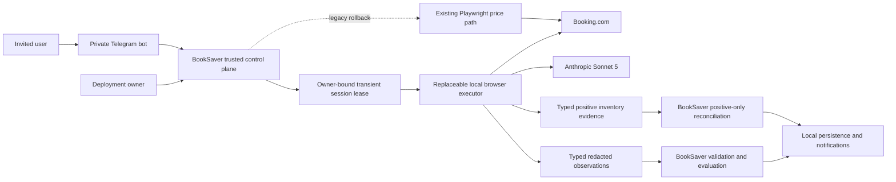

# System Context: Replaceable Agentic Browser Executor

## Actors

- **Deployment owner** (Human): Self-hosts BookSaver, configures the Anthropic key, owns operational
  cost and privacy policy, runs the live canary, and controls promotion/rollback.
- **Invited user** (Human): Uses the private Telegram bot, supplies a Booking session through
  `/connect`, and may consent to owner-funded agentic checks.
- **BookSaver scheduler/coordinator** (System): Authorizes and serializes checks under the global
  browser lease and daily limits.
- **BookSaver validation/evaluation** (System): Independently validates untrusted observations,
  selects equivalent refundable all-in offers, persists results, and permits notifications.
- **Local browser executor** (System): Performs bounded perception and read-only navigation in a
  transient browser without domain authority.
- **Inventory reconciliation policy** (System): Accepts only validated positive reservation
  observations, derives eligibility, and prevents agentic evidence from marking unseen rows absent.

## External Systems

- **Booking.com**: Authenticated mobile-web pricing and account content over HTTPS; dynamic,
  unversioned presentation surface.
- **Anthropic API**: Sonnet 5 semantic and computer-use inference using the deployment owner's key;
  receives bounded visible page evidence but never session cookies or credentials.
- **Telegram**: Existing invite-only user interaction, `/connect` disclosure, and notifications.
- **Loopback services**: In-process Stagehand runner and any local telemetry sink; no content export.

## Trust Boundaries

1. BookSaver domain inputs, authorization, session ownership, and budgets are trusted code-owned
   inputs.
2. Decrypted cookies exist only inside a transient local browser boundary.
3. Stagehand actions, extraction, and Anthropic outputs are untrusted proposals/evidence.
4. The code guard owns every browser mutation and rejects unsafe requests before and after action.
5. Only BookSaver validation/evaluation can create a valid candidate, savings opportunity, or
   notification.

## Data Flows

### Inbound

- Trusted booking property reference, dates, occupancy, expected currency, owner/session binding,
  deadline, action limit, and cost reservation.
- Trusted inventory scopes, authorized account binding, and current-run execution identity.
- Stagehand semantic action proposals and typed extraction.
- Anthropic computer-use action requests, typed observation submissions, terminal outcomes, and
  usage data.
- Booking.com rendered visible content and server-verified authentication state.

### Outbound

- Guarded read-only browser actions to Booking.com.
- Bounded semantic evidence and escalation screenshots to Anthropic.
- Typed, redacted price observations to BookSaver validation.
- Typed positive reservation observations and traversal coverage to BookSaver inventory validation.
- Redacted metrics/failure codes to local persistence and owner-only operations.
- Existing savings notifications after independent validation.

### Forbidden Flows

- Cookies, credentials, MFA values, clipboard, files, model reasoning, or full page evidence to
  results/logs/persistence.
- Model-selected arbitrary URLs or unguarded browser actions.
- Executor decisions about equivalence, savings, transaction authority, or user identity.
- Executor decisions that inventory is authoritatively complete or that an unseen reservation is
  absent.

## System Context Diagram

## Lifecycle

1. Coordinator authorizes the user and booking, reserves budget, and selects routing mode.
2. Session service decrypts verified cookies into a fresh local browser owned by a scoped lease.
3. Stagehand observes, proposes, and extracts; code replays only guarded actions.
4. One guarded Anthropic computer-use episode may continue on the same browser after semantic
   failure.
5. Executor returns typed evidence without domain conclusions or secret material.
6. BookSaver validates facts, evaluates equivalence/savings, reconciles cost, optionally persists
   verified refreshed cookies, records redacted metrics, and destroys the browser profile.

## Inventory Lifecycle

1. A disclosed authorized user triggers `/bookings`, post-connect synchronization, `/checknow`, or a
   scheduled slot under the single coordinator gate.
2. BookSaver issues an account-bound session lease and fixed upcoming, past, and cancelled work
   scopes to the inventory executor.
3. Stagehand extracts typed page state and proposes only read-only scope, pagination, or detail
   actions; BookSaver guards and replays each action.
4. The executor returns positive reservation evidence and redacted traversal metadata. It cannot
   establish authoritative absence or completeness.
5. BookSaver validates stable identities and domain facts, persists accepted current-run positives,
   preserves unseen rows, and permits a price check only for a reservation re-observed in that run.
