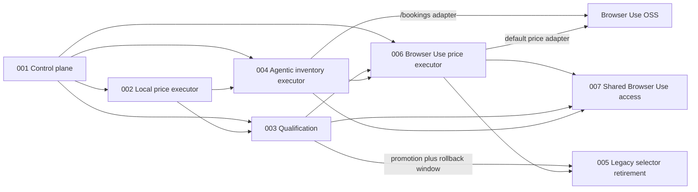

# Units: Replaceable Agentic Browser Executor

## Unit Decomposition

### 012-trusted-inventory-reconciliation

- Purpose: Reconcile the covered current list from code-owned proof; retire absent active rows,
  preserve incomplete unseen history explicitly, and distinguish cancellation/rebooking identities.
- Assigned requirements: FR31–33; stories US192–194; Bolt077 construction complete; Operations verified on reviewed 153d432.
- Dependencies: completed Units004/010/011 and the existing coordinator, validator and SQLite boundary.

### 011-grouped-trip-discovery

- Purpose: Cover grouped trips/reservations/details with code-owned evidence, preserve strict
  eligibility/current-stay distinctions, and qualify the actual caller through exact-image release.
- Assigned requirements: FR-28, FR-29, FR-30. Stories: US-187 through US-191. Bolts074–076
  construction complete; the corrected price submission contract awaits new-image qualification.
- Dependencies: Units 004, 007, and 010; existing normal-coordinator replay and browser lease.
- Actual caller 22 qualified both grouped coverage and authenticated mobile pricing. The final
  reviewed image still requires Dev/Staging qualification and authorized production promotion.

### 010-caller-inventory-outcomes

- Purpose: Recognize non-destructive empty/partial inventory outcomes, explain caller status plainly,
  and verify account-specific behavior without modifying production truth.
- Assigned requirements: FR-25, FR-26, FR-27. Stories: US-184 through US-186. Bolt 073.
- Dependencies: Units 004, 007, and 008; existing caller-scoped replay and coordinator/browser lease.

### 009-price-rejection-diagnostics

- Purpose: Versioned, bounded evidence explaining rejected offers and actual room decisions.
- Story: US-174. Bolt 068. No changes to acceptance, providers, or session authority.

### 008-connect-refresh-status

- Purpose: Correct post-login notification ordering, busy responses, and positive-only inventory
  completion messages. No new queue, browser lock, dependency, or database change.
- Story: US-172. Construction: Bolt 066.

### 001-agentic-executor-control-plane

- **Purpose**: Define provider-neutral contracts, owner-bound session leases, BookSaver validation,
  cost accounting, fake execution, and routing without changing production routing.
- **Assigned Requirements**: FR-1, FR-2, FR-3, FR-6, FR-7
- **Dependencies**: Existing coordinator, session vault, model budget, offer policy, and legacy monitor.

### 002-local-agentic-price-executor

- **Purpose**: Implement the local Stagehand semantic path and guarded Anthropic computer-use fallback
  for complete price-check navigation and rate perception.
- **Assigned Requirements**: FR-4, FR-5, FR-8
- **Dependencies**: Unit 001 and the existing transient Chromium/browser lease.

### 003-agentic-browser-qualification

- **Purpose**: Prove safety, DOM resilience, privacy, cost, and reliability; govern owner canary,
  invited-user promotion, and regression rollback.
- **Assigned Requirements**: FR-9
- **Dependencies**: Units 001 and 002.

### 004-agentic-inventory-executor

- **Purpose**: Replace selector-dependent inventory perception with provider-neutral agentic
  executors while preserving positive-only reconciliation; `/bookings` first qualified local
  Browser Use and Unit 006 expands it to every agentic inventory trigger.
- **Assigned Requirements**: FR-10, FR-12
- **Dependencies**: Units 001 and 002; existing account synchronization and reconciliation policy.

### 005-legacy-price-selector-retirement

- **Purpose**: Retire the legacy price path only after price promotion and the complete rollback
  window.
- **Assigned Requirements**: FR-11
- **Dependencies**: Unit 003 promotion approval, Unit 006 Browser Use qualification, and 30 days
  without rollback.

### 006-browser-use-price-executor

- **Purpose**: Make local Browser Use the default provider-neutral price executor for manual and
  scheduled checks, remove the Stagehand inventory prerequisite, preserve explicit
  Stagehand/deterministic rollback, version qualification, and prove the deployed path with an
  operator-only replay.
- **Assigned Requirements**: FR-13, FR-14, FR-15, FR-16, FR-17, FR-18, FR-19, FR-20
- **Dependencies**: Units 001, 002, 003, and 004; existing coordinator, price validation,
  qualification ledger, and Browser Use runtime.

### 007-shared-browser-use-access

- **Purpose**: Admit every currently disclosed active invitee to the proven Browser Use inventory
  and price path through an explicit owner-authorized route, and expose secret-safe API funding
  provenance in the owner-only Telegram admin projection.
- **Assigned Requirements**: FR-21, FR-22
- **Dependencies**: Units 001, 003, 004, and 006; Intent 010 aggregate-admin privacy boundary.

## Requirement-to-Unit Mapping

| Requirement | Unit |
|-------------|------|
| FR-1, FR-2, FR-3, FR-6, FR-7 | `001-agentic-executor-control-plane` |
| FR-4, FR-5, FR-8 | `002-local-agentic-price-executor` |
| FR-9 | `003-agentic-browser-qualification` |
| FR-10, FR-12 | `004-agentic-inventory-executor` |
| FR-11 | `005-legacy-price-selector-retirement` |
| FR-13, FR-14, FR-15, FR-16, FR-17, FR-18, FR-19, FR-20 | `006-browser-use-price-executor` |
| FR-21, FR-22 | `007-shared-browser-use-access` |
| FR-23 | `008-connect-refresh-status` |
| FR-24 | `009-price-rejection-diagnostics` |
| FR-25, FR-26, FR-27 | `010-caller-inventory-outcomes` |
| FR-28, FR-29, FR-30 | `011-grouped-trip-discovery` |
| FR-31, FR-32, FR-33 | `012-trusted-inventory-reconciliation` |

Each functional requirement is assigned exactly once. Cross-unit constraints remain traced through
dependencies and story acceptance criteria.

## Dependency Graph

## Construction Sequence

1. Bolt 050: contracts and control plane; no production routing change.
2. Bolt 051: Stagehand/computer-use adapter and routing modes; `legacy` remains default.
3. Bolt 054: correct Stagehand launch for the non-root Docker runtime and prove exact-image startup.
4. Bolt 052: fixtures, privacy/egress tests, canary ledger, and promotion evaluator. Software can be
   completed, but live qualification remains a real 14-day owner checkpoint.
5. Bolt 053: agentic inventory contracts, adapter, routing, positive-only reconciliation, and
   single-refresh `/checknow`; construction is authorized before price promotion.
6. Bolt 056: layered read-only destination policy and privacy-safe rejection diagnostics.
7. Bolt 057: thread-owned persistent cost accounting across the async Stagehand boundary.
8. Bolt 058: provider-compatible Stagehand extraction and Anthropic computer-use schemas.
9. Bolt 059: version-matched mobile session identity and typed navigation-failure classification.
10. Bolt 060: trigger-specific local Browser Use executor for `/bookings`; every other trigger keeps
   its current executor.
11. Bolt 061: use the canonical HTTPS inventory entry after production showed Booking.com's legacy
    entry redirecting through blocked HTTP before Browser Use could perceive the page.
12. Bolt 062: remove cached-row completion and prove unknown live inventory discovery.
13. Bolt 063: distinguish accepted positive observations from authoritative completeness in the
    `/bookings` outcome and verify the waiting coordinator process exits successfully.
14. Bolt 064: make Browser Use the default price executor for `/checknow` and scheduled work,
    expand it to every agentic inventory prerequisite, add model-view preflight and
    production-equivalent replay, and preserve explicit rollback.
15. Bolt 065: add explicit `consented_users` routing for disclosed invitees and safe owner-only API
    funding/key-presence visibility.
16. Bolt 066: distinguish login, inventory refresh, and price checks with accurate ordering.
17. Bolt 068: retain bounded price-rejection diagnostics without changing acceptance.
18. Bolt 073: preserve validated partial positives, recognize code-observed empty upcoming inventory
    without absence authority, simplify Telegram outcomes, and qualify caller-specific paths.
19. Bolt 055: legacy price-selector retirement, blocked until Browser Use price promotion and the
    30-day rollback window pass.

20. Bolt 074: evidence-grounded grouped-trip/reservation/detail discovery, strict fact eligibility and
    current/upcoming reporting, actual-caller coverage acceptance, and exact-image release checks.

21. Bolt077: trusted current-list proof, scoped absence retirement, identity-safe cancellation and
    unverified saved-row presentation; mandatory caller/release qualification.
