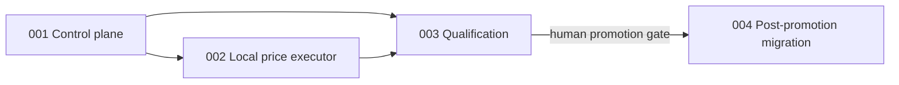

# Units: Replaceable Agentic Browser Executor

## Unit Decomposition

### 001-agentic-executor-control-plane

- **Purpose**: Define provider-neutral contracts, owner-bound session leases, BookSaver validation,
  cost accounting, fake execution, and routing without changing production routing.
- **Assigned Requirements**: FR-1, FR-2, FR-3, FR-6, FR-7
- **Dependencies**: Existing coordinator, session vault, model budget, offer policy, and legacy monitor.

### 002-local-agentic-price-executor

- **Purpose**: Implement the local Stagehand semantic path and guarded Anthropic computer-use fallback
  for complete price-check navigation and rate perception.
- **Assigned Requirements**: FR-4, FR-5, FR-8
- **Dependencies**: Unit 001 and the existing transient Chromium/browser lease.

### 003-agentic-browser-qualification

- **Purpose**: Prove safety, DOM resilience, privacy, cost, and reliability; govern owner canary,
  invited-user promotion, and regression rollback.
- **Assigned Requirements**: FR-9
- **Dependencies**: Units 001 and 002.

### 004-post-promotion-browser-migration

- **Purpose**: After approved price-check promotion, migrate inventory and remaining DOM-dependent
  account perception and retire legacy price selectors after the rollback window.
- **Assigned Requirements**: FR-10
- **Dependencies**: Unit 003 promotion approval.

## Requirement-to-Unit Mapping

| Requirement | Unit |
|-------------|------|
| FR-1, FR-2, FR-3, FR-6, FR-7 | `001-agentic-executor-control-plane` |
| FR-4, FR-5, FR-8 | `002-local-agentic-price-executor` |
| FR-9 | `003-agentic-browser-qualification` |
| FR-10 | `004-post-promotion-browser-migration` |

Each functional requirement is assigned exactly once. Cross-unit constraints remain traced through
dependencies and story acceptance criteria.

## Dependency Graph

## Construction Sequence

1. Bolt 050: contracts and control plane; no production routing change.
2. Bolt 051: Stagehand/computer-use adapter and routing modes; `legacy` remains default.
3. Bolt 052: fixtures, privacy/egress tests, canary ledger, and promotion evaluator. Software can be
   completed, but live qualification remains a real 14-day owner checkpoint.
4. Bolt 053: planned and blocked until the live promotion gate passes.
