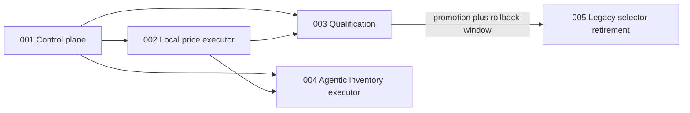

# Units: Replaceable Agentic Browser Executor

## Unit Decomposition

### 001-agentic-executor-control-plane

- **Purpose**: Define provider-neutral contracts, owner-bound session leases, BookSaver validation,
  cost accounting, fake execution, and routing without changing production routing.
- **Assigned Requirements**: FR-1, FR-2, FR-3, FR-6, FR-7
- **Dependencies**: Existing coordinator, session vault, model budget, offer policy, and legacy monitor.

### 002-local-agentic-price-executor

- **Purpose**: Implement the local Stagehand semantic path and guarded Anthropic computer-use fallback
  for complete price-check navigation and rate perception.
- **Assigned Requirements**: FR-4, FR-5, FR-8
- **Dependencies**: Unit 001 and the existing transient Chromium/browser lease.

### 003-agentic-browser-qualification

- **Purpose**: Prove safety, DOM resilience, privacy, cost, and reliability; govern owner canary,
  invited-user promotion, and regression rollback.
- **Assigned Requirements**: FR-9
- **Dependencies**: Units 001 and 002.

### 004-agentic-inventory-executor

- **Purpose**: Replace selector-dependent inventory perception with a provider-neutral Stagehand
  executor for every disclosed authorized user while preserving positive-only reconciliation.
- **Assigned Requirements**: FR-10
- **Dependencies**: Units 001 and 002; existing account synchronization and reconciliation policy.

### 005-legacy-price-selector-retirement

- **Purpose**: Retire the legacy price path only after price promotion and the complete rollback
  window.
- **Assigned Requirements**: FR-11
- **Dependencies**: Unit 003 promotion approval and 30 days without rollback.

## Requirement-to-Unit Mapping

| Requirement | Unit |
|-------------|------|
| FR-1, FR-2, FR-3, FR-6, FR-7 | `001-agentic-executor-control-plane` |
| FR-4, FR-5, FR-8 | `002-local-agentic-price-executor` |
| FR-9 | `003-agentic-browser-qualification` |
| FR-10 | `004-agentic-inventory-executor` |
| FR-11 | `005-legacy-price-selector-retirement` |

Each functional requirement is assigned exactly once. Cross-unit constraints remain traced through
dependencies and story acceptance criteria.

## Dependency Graph

## Construction Sequence

1. Bolt 050: contracts and control plane; no production routing change.
2. Bolt 051: Stagehand/computer-use adapter and routing modes; `legacy` remains default.
3. Bolt 052: fixtures, privacy/egress tests, canary ledger, and promotion evaluator. Software can be
   completed, but live qualification remains a real 14-day owner checkpoint.
4. Bolt 053: agentic inventory contracts, adapter, routing, positive-only reconciliation, and
   single-refresh `/checknow`; construction is authorized before price promotion.
5. Bolt 056: layered read-only destination policy and privacy-safe rejection diagnostics.
6. Bolt 057: thread-owned persistent cost accounting across the async Stagehand boundary.
7. Bolt 058: provider-compatible Stagehand extraction and Anthropic computer-use schemas.
8. Bolt 059: version-matched mobile session identity and typed navigation-failure classification.
9. Bolt 055: legacy price-selector retirement, blocked until price promotion and the 30-day rollback
   window pass.
