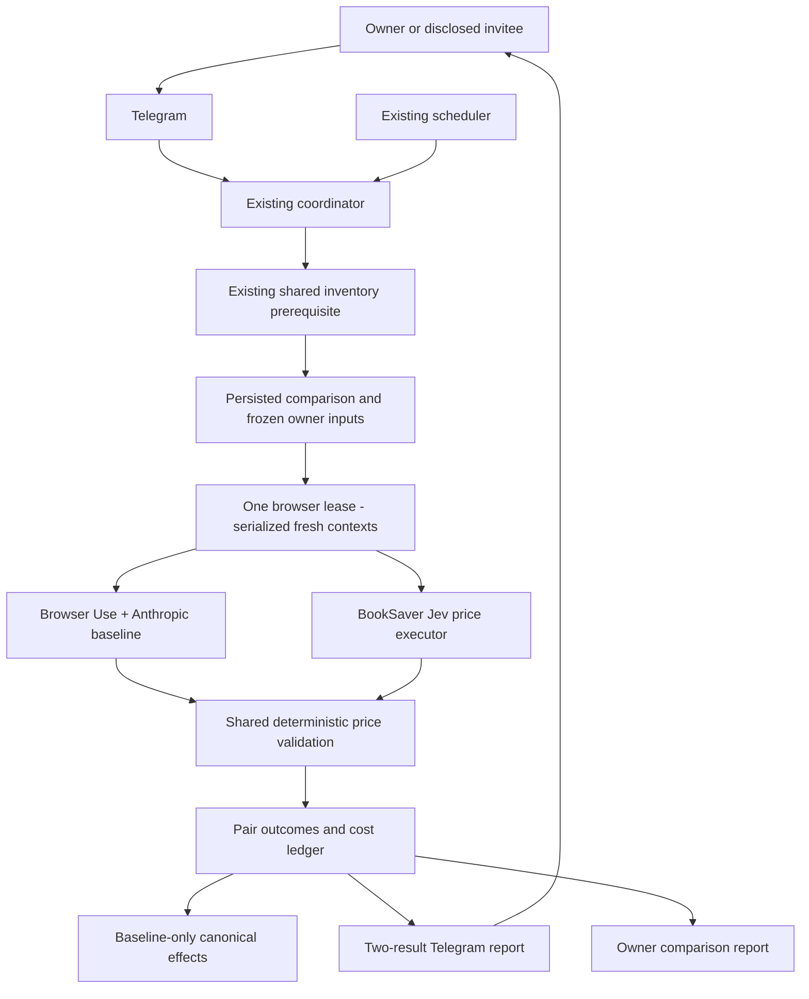

# System context

## Actors and boundary

The self-hosting owner funds the providers and controls experiment activation. Active invited users
receive their own paired price reports after the current provider-specific disclosure. Manual
Telegram requests and the existing scheduler share CheckCoordinator. Inventory refresh remains the
existing flow; one trusted booking snapshot feeds two isolated price executions.

## External integrations and data flow

| System | Direction and protocol | Exchanged data and boundary |
|---|---|---|
| Booking.com | Browser HTTPS | Owner session stays within that local browser context; current visible offers are untrusted evidence |
| Anthropic | Server HTTPS, existing SDK | Baseline's existing approved representation and model usage |
| TypeSafe | Server HTTPS, direct System One API | Sanitized bounded visible text/options and typed questions; decisions, version, token usage returned |
| Telegram | Existing bot HTTPS transport | Caller-scoped pair summary; no provider keys, page dumps, or raw session references |
| Local SQLite/vault | Existing local interfaces | Encrypted session source; restricted pair/cost/outbox metadata; no new public service |

## Ownership and candidate isolation

PriceExecutionRequest/Result and BookSaver-owned validation remain the authority boundary. The
candidate never receives baseline pages, answers, selected offers or mutable canonical state. Both
start from the same immutable session snapshot captured before either run; baseline refreshed cookies
are applied only through existing verified revision checks, after both starting snapshots are fixed.
Candidate session refresh is discarded. Access and session revision are rechecked before each arm
and delivery; revocation overrides comparability.

## Current implementation seams

- src/booksaver/application/browser_executor.py: execution and validation service without domain effects.
- src/booksaver/infrastructure/browser/browser_use_price_executor.py: existing baseline adapter.
- src/booksaver/infrastructure/browser/browser_use_runtime.py: guarded host/actions and Anthropic wrapper.
- src/booksaver/daemon/check_coordinator.py: shared admission, manual/scheduled paths, budgets and effects.
- src/booksaver/monitor/search_check_job.py: additional persistence/failure effects to separate from execution.
- src/booksaver/infrastructure/telegram/check_now.py: manual result presentation; scheduled reports need wiring.
- src/booksaver/application/savings_pipeline.py: canonical savings and notification authority.
- src/booksaver/domain/model_policy.py and infrastructure/persistence/schema.sql: Anthropic-only identities/checks.

## Policy relationships requiring construction ADRs

Preserve ADR-036 trusted control plane and ADR-044 inventory choice. Amend ADR-043 only to permit
an explicit pair of independent child price executions (never fallback); preserve existing single
method behavior outside paired mode. Amend ADR-048 combined deadline only for the explicit paired
mode. Extend ADR-031 accounting and ADR-002 secret configuration for TypeSafe, and ADR-045/046
provider disclosure/funding/reporting. Existing historical price qualification in intent 023 is
neither completed nor inherited by this experiment. Draft design choices are not accepted ADRs yet.
