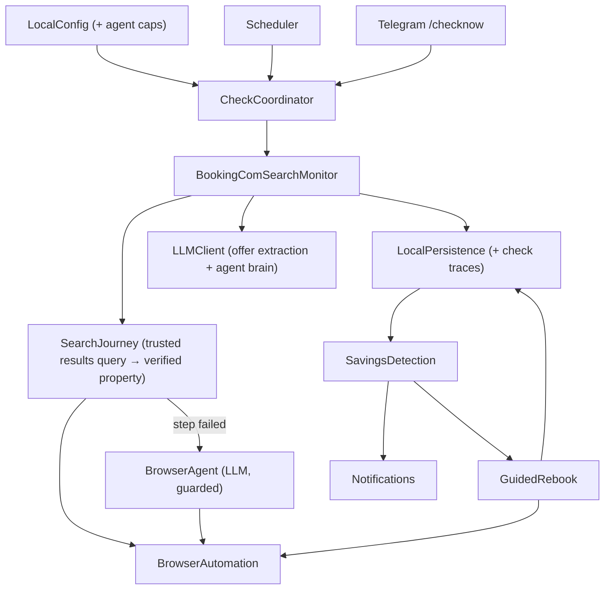

# System Architecture Standards

## Architecture Style

Use a single-process, local-first daemon architecture. Keep components modular inside one Python application rather than introducing distributed services.

## Boundaries

- Booking.com integration happens through browser automation only. Live prices come from a trusted
  results query followed by exact property selection, fresh property navigation, context verification,
  availability/rate readiness, and room-rate extraction (ADR-013 amended by ADR-020); property loading
  does not depend on a legacy room-table selector, and the homepage form, manage page, registered-
  property deep link, and result-card headline price are not price sources.
- The LLM is used for extraction and reasoning when DOM parsing is insufficient, and as a
  guarded browser agent when a scripted journey step fails (ADR-015/016): bounded action
  vocabulary, adapter-level denylist against reserve/checkout/payment/cancel, hard
  per-check cost caps (ADR-017).
- Scheduled and Telegram-triggered live checks enter one daemon-lifetime coordinator. It serializes
  Playwright work, shares per-user daily check/actual-LLM counters, and reuses the complete monitor,
  trace, savings, and notification pipeline (ADR-021); do not add a second scheduler or browser path.
- Notification adapters send directly through the user's configured services.
- Guided rebook must never execute cancel or purchase actions without explicit local confirmation.
- All secrets, sessions, booking data, logs, and check history remain on the user's machine.

## Unit Build Order

1. Core & Local Data
2. Booking.com Price Monitor
3. Savings Detection & Notifications
4. Guided Rebook
5. Extensibility (future only)
