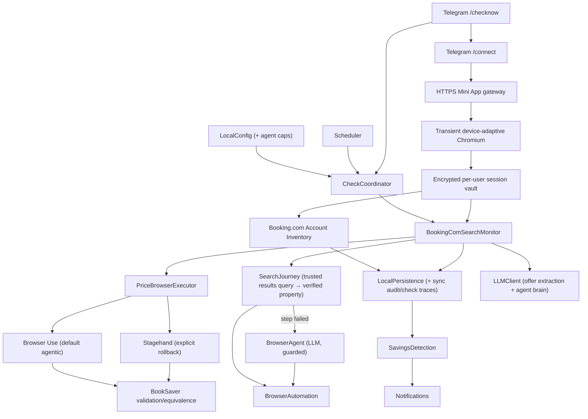

# System Architecture Standards

## Architecture Style

Use a single-process, local-first daemon architecture. Keep components modular inside one Python application rather than introducing distributed services.

## Boundaries

- Booking.com integration happens through browser automation only. Live prices come from a trusted
  results query followed by exact property selection, fresh property navigation, context verification,
  availability/rate readiness, and room-rate extraction (ADR-013 amended by ADR-020); property loading
  does not depend on a legacy room-table selector, and the homepage form, manage page, registered-
  property deep link, and result-card headline price are not price sources.
- The LLM is used for extraction and reasoning when DOM parsing is insufficient, and as a
  guarded browser agent when a scripted journey step fails (ADR-015/016): bounded action
  vocabulary, adapter-level denylist against reserve/checkout/payment/cancel, hard
  per-check cost caps (ADR-017).
- Scheduled and Telegram-triggered live checks enter one daemon-lifetime coordinator. It serializes
  Playwright work, shares per-user daily check/actual-LLM counters, and reuses the complete monitor,
  trace, savings, and notification pipeline (ADR-021); do not add a second scheduler or browser path.
- The agentic price route selects one replaceable adapter behind `PriceBrowserExecutor`. Browser Use
  is the default for both manual and scheduled jobs; Stagehand is an explicit future-job rollback.
  Both restore the owner session only through local CDP and return untrusted typed evidence.
  BookSaver alone verifies query identity, dates, occupancy, authentication, currency, all-in total,
  refundability, equivalence, and savings. Never chain adapters within one job (ADR-043).
- Price admission supports an explicit `consented_users` mode that routes the active owner and
  currently disclosed active invitees through Browser Use before statistical qualification without
  mutating qualification evidence. Missing/stale invitee consent and global regression still fail
  closed; owner-canary and qualification-gated modes retain their original meaning (ADR-045).
- Telegram-owned checks resolve the booking owner's encrypted session and create a fresh Android
  Chromium mobile-web context; missing, stale, rendered-signed-out, or mismatched state fails closed
  as `auth_required` (ADRs 024–025). Never substitute a global, public, or another user's session.
- The authenticated Booking.com account inventory is authoritative for reservation facts and
  lifecycle (ADRs 027–028). Synchronize after `/connect`, before checks, and when `/bookings` is
  requested; preserve unseen reservations unless a complete traversal proves absence. Persist every
  visible reservation and derive monitorable booking projections only for reason-coded eligible rows.
- The opt-in `/connect` adapter is the narrow exception to outbound-only operation (ADR-026). A
  signed Telegram Mini App reaches a stdlib HTTP gateway behind Caddy TLS, drives one transient
  headed desktop or mobile Chromium browser through token-gated noVNC/websockify, and treats that page only as a cookie
  producer. A versioned isolated Booking server contract accepts exact negative controls—including
  the cookie-free edge-pending tuple—without closing the viewer, and captures cookies only after two
  exact positive probes issue a receipt bound to the immutable snapshot (ADR-035). It then tears
  down. The flow shares the same global browser lease as checks. No endpoint accepts credentials,
  cookie JSON, arbitrary URLs, uploads, or free-form browser actions.
- Interactive login selects an allowlisted desktop/mobile presentation after the signed viewer
  exchange (ADR-047); unopened attempts retain the shared lease but do not launch Chromium.
  Unknown device hints use mobile. Login cookies still require the isolated mobile verifier,
  and inventory/check contexts start in configured Android Chromium. Grouped inventory may follow
  the actual same-confirmation desktop-view link for booking facts, without exporting its cookies
  (ADR-048); price contexts retain the original mobile session. Device hints are presentation data,
  never identity evidence; actual desktop-login-to-mobile-check reuse needs live qualification.
- Combined inventory-and-price operations have a fixed 360-second ceiling, while each executor
  phase remains capped at 180 seconds and shares the existing cost/action/visual ledger (ADR-048).
  Inventory-only work remains capped at 180 seconds; shutdown prevents admission of another phase.
- The remote login browser runs on the trusted self-hosted VPS. HTTPS and encryption do not protect
  keystrokes against compromised VPS root; stronger disposable/device-local isolation is future
  hardening, not a security property of the current design.
- Notification adapters send directly through the user's configured services.
- Savings notifications are informational. BookSaver does not create or guide a rebooking workflow;
  users manage reservations directly in Booking.com and later synchronization observes the result.
- All secrets, sessions, booking data, logs, and check history remain on the user's machine.
- The owner-only Telegram aggregate may expose current Browser Use funding as deployment-owner-paid
  and personal legacy-key presence as configured/not configured. It never selects, decrypts,
  fingerprints, or displays key material and makes no unsupported historical attribution (ADR-046).

## Unit Build Order

1. Core & Local Data
2. Booking.com Account Synchronization
3. Booking.com Price Monitor
4. Savings Detection & Notifications
5. Extensibility (future only)

## Session continuity and explicit paste (ADRs 050–051)

Session freshness is distinct from Booking.com's server authentication. Daily renewal runs through
the existing daemon scheduler and sole coordinator/browser gate, uses no model calls and has a
bounded protected-resource verification contract. An ephemeral supervised Linux worker provides
confirmed browser cleanup before the same gate is released (ADR050); unsupported platforms disable
background maintenance without false login failures. Persist only positively verified mobile-context
cookies and durable per-user retry state in the encrypted vault. Incidental cookie expiry is not
proof of sign-out. Legacy ACTIVE local-expired bundles can enter a verification-only recovery path;
normal checks remain blocked until proof. Explicit reauthentication/revocation/purge, caller identity
and revision races remain fail-closed. Temporary failure does not become a false logout.

The remote viewer supports one-way, explicit user paste through the RFB keyboard path. Local text
is transient and cleared; clipboard polling/synchronization/writes and credential HTTP endpoints
remain prohibited. Bind async clipboard results to the exact live connection and discard on
teardown or replacement. Native Telegram acceptance is distinct from automated stack qualification.
